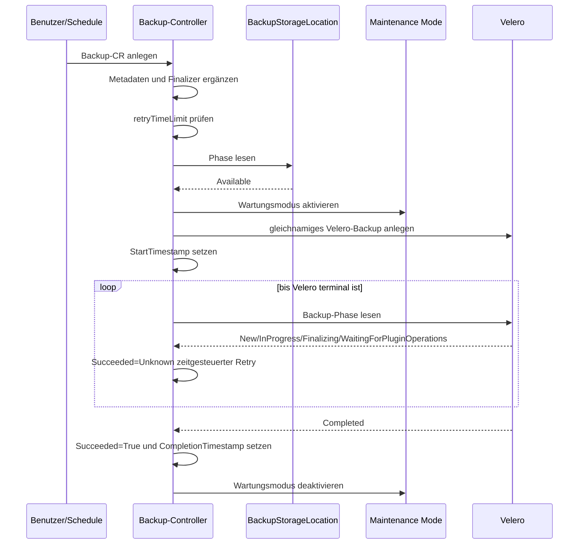
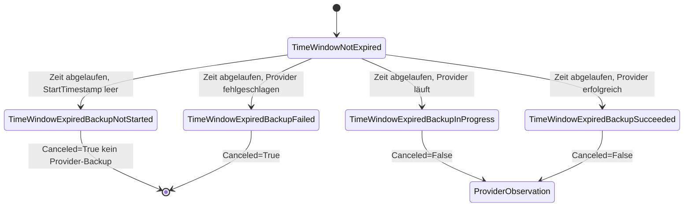
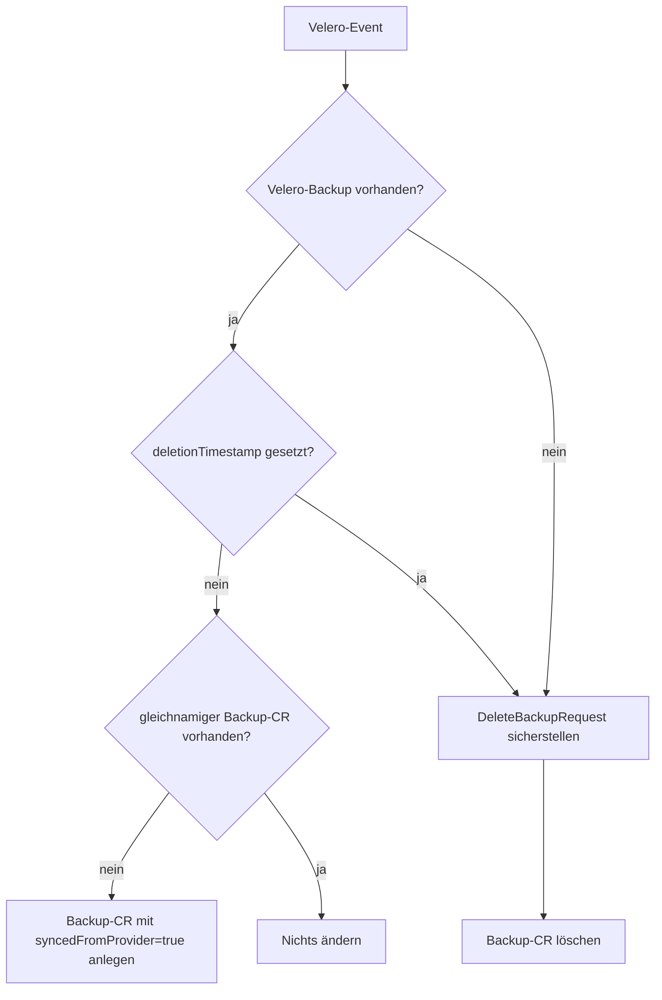
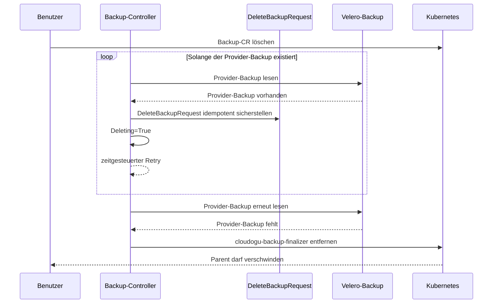

# Backup-Prozess

Diese Dokumentation beschreibt den Backup-Workflow des `k8s-backup-operator` aus Entwicklersicht.

Der Backup-Bereich besteht aus zwei Controllern:

- Der **Backup-Controller** verarbeitet `k8s.cloudogu.com/v1`-`Backup`-Ressourcen, prüft Voraussetzungen, aktiviert den Wartungsmodus, erstellt und beobachtet das Provider-Backup und wickelt Löschungen ab.
- Der **Velero-Backup-Synchronisationscontroller** beobachtet Velero-`Backup`-Ressourcen. Er erzeugt fehlende CES-Backup-CRs für bereits beim Provider vorhandene Backups und koppelt Löschungen in beide Richtungen.

Der derzeit konkret implementierte Provider ist Velero. CES-Backup und Velero-Backup verwenden denselben Namen und Namespace.

## Controller-Steuerung

Der Backup-Controller führt eine feste Liste von `ensure...`-Methoden aus. Jede Stage liefert eine Aktion:

| Aktion | Bedeutung |
|---|---|
| `Next` | Die nächste Stage läuft im selben Reconcile. |
| `Retry` | Der Reconcile endet mit dem konfigurierten `requeueAfter`. |
| `Abort` | Der Reconcile endet ohne explizites Requeue. |

Ein gleichzeitig zurückgegebener Fehler wird an `controller-runtime` weitergereicht und löst dessen Backoff aus. Der Requeue-Abstand stammt aus `operatorConfig.RequeueTimeSeconds`.

Anders als der Restore-Controller verwendet der Backup-Controller einen Event-Filter. Reconciles werden bei einer geänderten `generation` sowie beim erstmaligen Setzen des `deletionTimestamp` ausgelöst. Reine Statusänderungen des Backup-CR lösen über diesen Controller kein weiteres Event aus. Das Warten auf Provider-Fortschritt erfolgt deshalb über `Retry` und nicht über einen Watch auf owned Children.

## Stage-Reihenfolge

Die Methodenfolge lautet:

1. `ensureBackupLeaseReleased` - Eigenes Lease bei terminalem oder gelöschtem Backup freigeben - Aufräumen bestehender Backup-Leases
2. `ensureProviderBackupDeleted` - Provider-Backup-Löschung behandeln
3. `ensureVeleroStatusSynced` - Von Velero importierten Status synchronisieren
4. `ensureCompletedBackupIsIgnored` - Terminales lokales Backup ignorieren
5. `ensureBackupSetup` - Labels, Blueprint-Annotationen und Finalizer sicherstellen
6. `ensureBackupIsCanceledAfterTimeWindowExpired` - Zeitfenster prüfen
7. `ensureBackupIsPrepared` - BackupStorageLocation prüfen
8. `ensureActiveBackupLease` - Gemeinsames Backup-/Restore-Lease beanspruchen
9. `ensureMaintenanceActivated` - Maintenance Mode aktivieren
10. `ensureProviderBackupCreated` - Velero-Backup sicherstellen
11. `ensureProviderBackupCompleted` - Velero-Phase beobachten
12. `ensureMaintenanceDeactivated` - Maintenance Mode deaktivieren
13. `ensureBackupLeaseReleased` - Eigenes Lease nach erfolgreichem Backup freigeben - Aufräumen des eigenen Backup-Lease

Die Lease-Freigabe steht am Anfang, damit terminale oder zu löschende Backups sie vor einem `Abort` oder `Retry` erreichen. Sie verändert den Wartungsmodus nicht; dafür bleibt ausschließlich `ensureMaintenanceDeactivated` zuständig.

## Erfolgreicher lokaler Backup-Ablauf



### Setup und Metadaten

`ensureBackupSetup` setzt folgende Metadaten:

- Labels `app=ces` und `k8s.cloudogu.com/part-of=backup`
- Finalizer `cloudogu-backup-finalizer`
- Annotation `backup.cloudogu.com/blueprintId` mit dem Display-Namen des ersten Blueprints im Namespace
- Annotation `backup.cloudogu.com/dogus` mit dessen Dogu-Liste als JSON

Existiert kein Blueprint, läuft der Workflow ohne Blueprint-Annotationen weiter. Andere Fehler beim Listen oder Serialisieren brechen den Reconcile mit Fehler ab. Vorhandene fremde Labels, Annotationen und Finalizer bleiben erhalten; verwaltete Werte werden bei Abweichung korrigiert.

### Zeitfenster und Abbruch

Die ConfigMap `k8s-backup-operator-backup-config` muss im Backup-Namespace den Schlüssel `retryTimeLimit` enthalten. Der Wert ist eine Ganzzahl in Minuten. Das Zeitfenster ist abgelaufen, wenn gilt:

```text
now - metadata.creationTimestamp > retryTimeLimit * time.Minute
```



Existiert kein Blueprint, läuft der Workflow ohne Blueprint-Annotationen weiter. Andere Fehler beim Listen oder Serialisieren brechen den Reconcile mit Fehler ab. Vorhandene fremde Labels, Annotationen und Finalizer bleiben erhalten; verwaltete Werte werden bei Abweichung korrigiert.

Fehlt die ConfigMap oder der Schlüssel, oder ist der Wert nicht numerisch, endet der Reconcile mit Fehler. `StartTimestamp` ist die Grenze zwischen „noch nicht gestartet“ und „bereits gestartet“.

### Vorbereitung

`ensureBackupIsPrepared` liest die konfigurierte Velero-`BackupStorageLocation`. Nur `status.phase=Available` ergibt `Prepared=True`. Eine fehlende oder nicht verfügbare Location ergibt `Prepared=False` und einen kontrollierten Retry. Andere API-Fehler werden zurückgegeben.

### Gemeinsames Backup-/Restore-Lease

Nach erfolgreicher Vorbereitung und vor der Aktivierung des Wartungsmodus beansprucht `ensureActiveBackupLease` das namespaceweite Kubernetes-`Lease` `k8s-backup-operator-restore`. Dasselbe Lease verwendet der Restore-Controller. Backup und Restore können ihre kritischen Abschnitte im selben Namespace dadurch nicht gleichzeitig ausführen.

Der Holder wird durch `spec.holderIdentity` (UID), `k8s.cloudogu.com/backup-operator-lease-holder-name` (Name) und `k8s.cloudogu.com/lease-holder-kind` (`Backup` oder `Restore`) beschrieben. Alle drei Felder werden gemeinsam geschrieben und müssen vorhanden sein; unvollständige Leases gelten als ungültig und werden nicht heuristisch repariert. Jeder Controller registriert nur den Resolver für seinen eigenen Ressourcentyp. Ein gesetzter fremder oder unbekannter Holder-Typ wird als aktiv behandelt und nicht übernommen; die beiden Workflows müssen sich daher nicht gegenseitig kennen. Ein eigenes Lease wird idempotent akzeptiert. Zeitablauf allein macht ein Lease nicht stale.

`ensureBackupLeaseReleased` läuft am Anfang jedes Reconcile. Die Stage löscht ausschließlich das eigene Lease, wenn der Backup terminal (`Succeeded=True`, `Succeeded=False` oder `Canceled=True`) oder zum Löschen markiert ist. Für laufende Backups und fremde Holder ist sie ein No-op. UID- und `resourceVersion`-Preconditions verhindern, dass ein inzwischen neu vergebenes Lease gelöscht wird. Die Stage ändert bewusst nicht den Wartungsmodus; alle terminalen Backup-Pfade müssen dessen Deaktivierung selbst sicherstellen.

### Wartungsmodus

Vor dem Erstellen des Velero-Backups muss der Wartungsmodus aktiv sein. Der Controller aktiviert ihn mit:

```text
Title: Service temporary unavailable
Text:  Backup in progress
force: false
```

Nach einem terminal erfolgreichen oder fehlgeschlagenen Provider-Backup wird ein noch aktiver Wartungsmodus deaktiviert. Aktivierung und Deaktivierung sind nicht best-effort; Fehler werden zurückgegeben.

Die Reihenfolge ist relevant: `ensureCompletedBackupIsIgnored` liegt vor den Maintenance-Stages. Die normale terminale Provider-Auswertung setzt `Succeeded` und ruft die Deaktivierung noch im selben Reconcile auf. Schlägt genau diese Deaktivierung fehl, sieht der nächste Reconcile bereits eine terminale `Succeeded`-Condition und wird vorher abgebrochen. Änderungen an dieser Logik müssen diese Wiederanlaufkante ausdrücklich berücksichtigen.

### Erzeugtes Velero-Backup

Der Operator erzeugt ein gleichnamiges Velero-Backup mit:

- genau dem Namespace des Backup-CR
- Storage Location aus der Operator-Konfiguration
- TTL `87660h`, ungefähr zehn Jahre
- `defaultVolumesToFsBackup=false`
- CES-Standardlabels und weitergereichten Backup-Annotationen

Enthaltene Ressourcentypen:

- `configmaps`
- `secrets`
- `persistentvolumeclaims`
- `persistentvolumes`
- `dogus.k8s.cloudogu.com`

Die Auswahl ist eine ODER-Verknüpfung aus:

1. `k8s.cloudogu.com/type=global-config`
2. Existenz des Labels `dogu.name`
3. Existenz des Labels `k8s.cloudogu.com/backup-scope`

Die Werte von `dogu.name` und `backup-scope` werden für die Auswahl nicht ausgewertet. Zusätzliche Ressourcen sind nur enthalten, wenn ihr Ressourcentyp zugleich in der obigen Include-Liste steht.

### Provider-Phasen

| Kategorie | Velero-Phasen | Ergebnis |
|---|---|---|
| laufend | `New`, `InProgress`, `Finalizing`, `FinalizingPartiallyFailed`, `WaitingForPluginOperations`, `WaitingForPluginOperationsPartiallyFailed` | `Succeeded=Unknown/ProviderBackupInProgress`, Retry |
| fehlgeschlagen | `FailedValidation`, `PartiallyFailed`, `Failed` | `Succeeded=False/ProviderBackupFailed` |
| erfolgreich | `Completed` | `Succeeded=True/ProviderBackupSucceeded` |
| nicht erwartet | beispielsweise `Deleting` | Fehler; kein impliziter Erfolg |

Beim Anlegen des Provider-Backups wird `StartTimestamp` nur gesetzt, wenn er noch leer ist. Beim terminalen Ergebnis wird `CompletionTimestamp` ebenfalls nur einmal gesetzt.

## Conditions

Lokale und aus dem Provider importierte Backups verwenden dieselben vier Conditions:

### `Deleting`

| Status | Reason | Bedeutung |
|---|---|---|
| `False` | `BackupNotDeleting` | Kein `deletionTimestamp`; normaler Workflow darf laufen. |
| `True` | `BackupDeleting` | Löschen wurde angefordert und der Provider-Backup existiert noch. |

### `Canceled`

| Status | Reason | Bedeutung |
|---|---|---|
| `False` | `TimeWindowNotExpired` | Startzeitfenster ist noch offen; der Backup wurde nicht abgebrochen. |
| `True` | `TimeWindowExpiredBackupNotStarted` | Backup wurde vor Ablauf nicht gestartet. |
| `False` | `TimeWindowExpiredBackupInProgress` | Backup lief beim Ablauf bereits und darf fortfahren. |
| `True` | `TimeWindowExpiredBackupFailed` | Provider war beim Ablauf bereits fehlgeschlagen. |
| `False` | `TimeWindowExpiredBackupSucceeded` | Provider war beim Ablauf bereits erfolgreich. |

### `Prepared`

| Status | Reason | Bedeutung |
|---|---|---|
| `False` | `ProviderBackupStorageLocationNotFound` | BackupStorageLocation fehlt. |
| `False` | `ProviderBackupStorageLocationNotAvailable` | Location existiert, ist aber nicht `Available`. |
| `True` | `ProviderBackupStorageLocationAvailable` | Provider-Speicher ist verwendbar. |
| `True` | `VeleroStatusSynced` | Importierter Backup existiert bereits bei Velero. |

### `Succeeded`

| Status | Reason | Bedeutung                                                                                                               |
|---|---|-------------------------------------------------------------------------------------------------------------------------|
| `Unknown` | `MaintenanceModesIsNotActive` | Das Aktivieren des Wartungsmodus wurde angestossen, der Modus ist aber aktuell noch nicht aktiv; Workflow läuft weiter. |
| `Unknown` | `ProviderBackupResourceDoesNotExist` | Provider-Child wurde gerade erzeugt.                                                                                    |
| `Unknown` | `ProviderBackupInProgress` | Provider arbeitet.                                                                                                      |
| `Unknown` | `VeleroBackupRunning` | Ein importierter Velero-Backup ist noch nicht terminal; unbekannte Phasen gelten ebenfalls als laufend.                 |
| `False` | `ProviderBackupFailed` | Provider ist terminal fehlgeschlagen.                                                                                   |
| `False` | `VeleroBackupFailed` | Ein importierter Velero-Backup meldet eine bekannte Fehlerphase.                                                        |
| `True` | `ProviderBackupSucceeded` | Provider ist erfolgreich abgeschlossen.                                                                                 |
| `True` | `VeleroStatusSynced` | Ein importierter Velero-Backup ist `Completed`.                                                                         |

`Succeeded=True` und `Succeeded=False` werden von `ensureCompletedBackupIsIgnored` als terminal behandelt. Der Name `MaintenanceModesIsNotActive` beschreibt historisch den Zustand vor der erfolgreichen Aktivierung.

Für `spec.syncedFromProvider=true` schreibt `ensureVeleroStatusSynced` den beobachteten Zustand ebenfalls in `Succeeded`. `WaitingForPluginOperationsPartiallyFailed` und `FinalizingPartiallyFailed` bleiben dabei nicht-terminal, weil Velero noch Plugin- beziehungsweise Finalisierungsarbeiten ausführt; erst die spätere terminale Phase `PartiallyFailed` setzt `Succeeded=False`. Zusätzlich werden Velero-Zeitstempel gespiegelt. Das Legacy-Feld `status.status` wird wie bei lokalen Backups zentral vom `conditionsUpdater` aus den Conditions abgeleitet.

## Velero-Backup-Synchronisierung

Der Synchronisationscontroller sorgt dafür, dass Provider- und CES-Katalog konvergieren:



Ein importierter Backup-CR erhält Provider `velero`, CES-Standardlabels, weitergereichte Annotationen und den Backup-Finalizer. Da Kubernetes beim Create keinen Status aus dem Objekt übernimmt, signalisiert `spec.syncedFromProvider=true` dem Hauptcontroller, den Status anschließend aus Velero zu lesen.

Wenn ein Velero-Backup gelöscht wird oder bereits fehlt, stellt der Controller zuerst idempotent einen gleichnamigen `DeleteBackupRequest` sicher und löscht danach den CES-Backup-CR. Der DeleteRequest verhindert, dass Velero die CR später aus noch vorhandenen Storage-Daten erneut rekonstruiert.

## Delete-Workflow eines Backup-CR



Der Controller wartet nicht auf den Status des DeleteRequests, sondern prüft bei jedem Retry, ob der Velero-Backup noch existiert. Erst nach dessen Verschwinden wird der Backup-Finalizer aus der Finalizer-Liste entfernt und der Parent aktualisiert. Andere Finalizer bleiben erhalten.

## Status-Persistenz und Idempotenz

Condition-Änderungen werden zentral über den `conditionsUpdater` mit einem Status-`MergeFrom`-Patch geschrieben. Dabei wird auch das von externen Systemen verwendete Legacy-Feld `status.status` bei lokalen und importierten Backups synchronisiert:

| Condition-Zustand | `status.status` |
|---|---|
| laufender Workflow oder nicht-terminale Condition | `in progress` |
| `Succeeded=True` | `completed` |
| `Succeeded=False` oder `Canceled=True` | `failed` |
| `Deleting=True` | `deleting` |
| noch keine Condition | bisheriger Wert, bei einem neuen Backup also leer |

`Deleting=True` hat Vorrang vor terminalen Erfolgs- oder Fehlerconditions.

`meta.SetStatusCondition` erhält bei unverändertem Status die vorhandene Transition-Zeit.
Status und Conditions werden nur bei tatsächlicher Abweichung aktualisiert.

## Acceptance-Tests

Die Cluster-Tests liegen in `acceptance-tests/backup_test.go` und tragen das Ginkgo-Label `backup`:

```bash
K8S_TEST_CLUSTER_KUBECONFIG=/absoluter/pfad/kubeconfig \
  make acceptance-test GINKGO_LABEL_FILTER=backup
```
