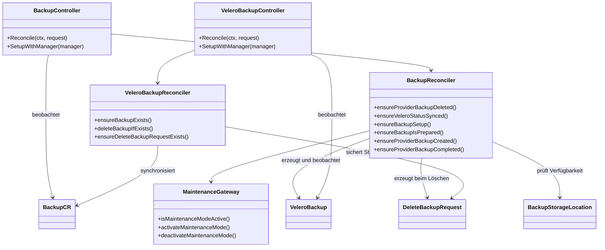
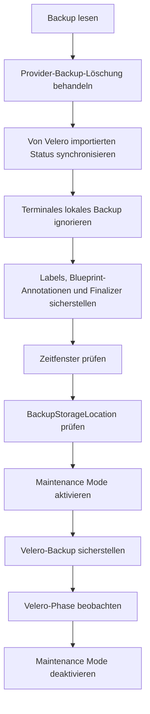
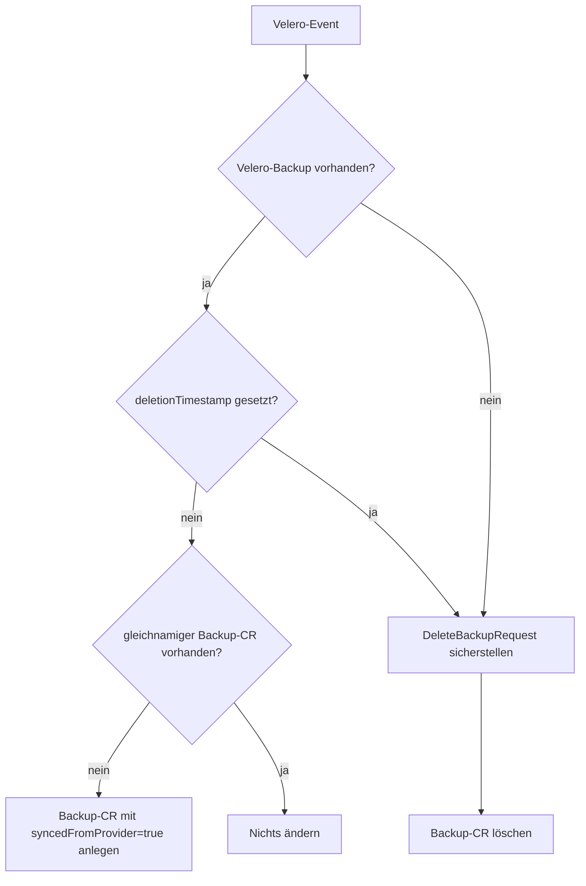
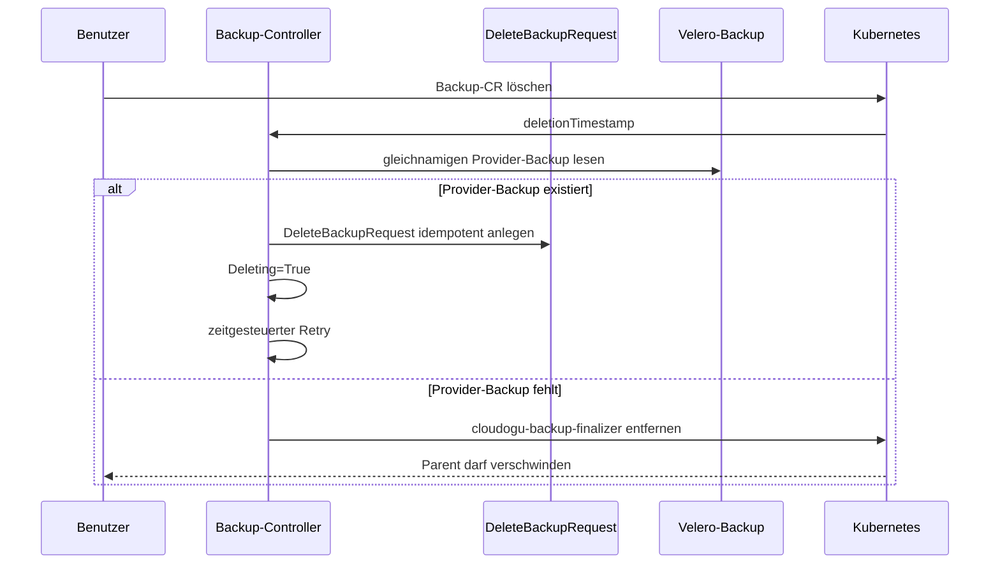

# Backup-Prozess

Diese Dokumentation beschreibt den Backup-Workflow des `k8s-backup-operator` aus Entwicklersicht. Maßgeblich ist die aktuell im Operator registrierte Implementierung unter `internal/controller/backup`. Die älteren Bausteine unter `pkg/backup` sind nicht der von `cmd/main.go` konfigurierte Controller-Pfad.

Der Backup-Bereich besteht aus zwei Controllern:

- Der **Backup-Controller** verarbeitet `k8s.cloudogu.com/v1`-`Backup`-Ressourcen, prüft Voraussetzungen, aktiviert den Maintenance Mode, erstellt und beobachtet den Provider-Backup und wickelt Löschungen ab.
- Der **Velero-Backup-Synchronisationscontroller** beobachtet Velero-`Backup`-Ressourcen. Er erzeugt fehlende CES-Backup-CRs für bereits beim Provider vorhandene Backups und koppelt Löschungen in beide Richtungen.

Der derzeit konkret implementierte Provider ist Velero. CES-Backup und Velero-Backup verwenden denselben Namen und Namespace.

## Architektur



## Controller-Steuerung

Der Backup-Controller führt eine feste Liste von `ensure...`-Methoden aus. Jede Stage liefert eine Aktion:

| Aktion | Bedeutung |
|---|---|
| `Next` | Die nächste Stage läuft im selben Reconcile. |
| `Retry` | Der Reconcile endet mit dem konfigurierten `requeueAfter`. |
| `Abort` | Der Reconcile endet ohne explizites Requeue. |

Ein gleichzeitig zurückgegebener Fehler wird an `controller-runtime` weitergereicht und löst dessen Backoff aus. Der Requeue-Abstand stammt aus `operatorConfig.RequeueTimeSeconds`.

Anders als der Restore-Controller verwendet der Backup-Controller einen Event-Filter. Reconciles werden bei einer geänderten `generation` sowie beim erstmaligen Setzen des `deletionTimestamp` ausgelöst. Reine Statusänderungen des Backup-CR lösen über diesen Controller kein weiteres Event aus. Das Warten auf Provider-Fortschritt erfolgt deshalb über `Retry` und nicht über einen Watch auf owned Children.

Der separate Velero-Controller trägt den Namen `velero-backup-sync`, beobachtet Velero-Backups direkt und verwendet keinen entsprechenden Generation-Filter.

## Stage-Reihenfolge



Die Methodenfolge lautet:

1. `ensureProviderBackupDeleted`
2. `ensureVeleroStatusSynced`
3. `ensureCompletedBackupIsIgnored`
4. `ensureBackupSetup`
5. `ensureBackupIsCanceledAfterTimeWindowExpired`
6. `ensureBackupIsPrepared`
7. `ensureMaintenanceActivated`
8. `ensureProviderBackupCreated`
9. `ensureProviderBackupCompleted`
10. `ensureMaintenanceDeactivated`

Löschung und Provider-Synchronisierung stehen bewusst vor der Terminalprüfung. Ein bereits abgeschlossenes lokales Backup wird ansonsten anhand von `Succeeded=True` oder `Succeeded=False` ignoriert.

## Erfolgreicher lokaler Backup-Ablauf

```mermaid
sequenceDiagram
    participant U as Benutzer/Schedule
    participant B as Backup-Controller
    participant S as BackupStorageLocation
    participant M as Maintenance Mode
    participant V as Velero

    U->>B: Backup-CR anlegen
    B->>B: Metadaten und Finalizer ergänzen
    B->>B: retryTimeLimit prüfen
    B->>S: Phase lesen
    S-->>B: Available
    B->>M: Maintenance Mode aktivieren
    B->>V: gleichnamiges Velero-Backup anlegen
    B->>B: StartTimestamp setzen
    loop bis Velero terminal ist
        B->>V: Backup-Phase lesen
        V-->>B: New/InProgress/Finalizing/WaitingForPluginOperations
        B->>B: Succeeded=Unknown; zeitgesteuerter Retry
    end
    V-->>B: Completed
    B->>B: Succeeded=True und CompletionTimestamp setzen
    B->>M: Maintenance Mode deaktivieren
```

### Setup und Metadaten

`ensureBackupSetup` konvergiert folgende Metadaten:

- Labels `app=ces` und `k8s.cloudogu.com/part-of=backup`
- Finalizer `cloudogu-backup-finalizer`
- Annotation `backup.cloudogu.com/blueprintId` mit dem Display-Namen des ersten Blueprints im Namespace
- Annotation `backup.cloudogu.com/dogus` mit dessen Dogu-Liste als JSON

Existiert kein Blueprint oder ist dessen CRD nicht installiert, läuft der Workflow ohne Blueprint-Annotationen weiter. Andere Fehler beim Listen oder Serialisieren brechen den Reconcile mit Fehler ab. Vorhandene fremde Labels, Annotationen und Finalizer bleiben erhalten; verwaltete Werte werden bei Abweichung korrigiert. Sind alle Werte bereits korrekt, erfolgt kein Update.

### Zeitfenster und Abbruch

Die ConfigMap `k8s-backup-operator-backup-config` muss im Backup-Namespace den Schlüssel `retryTimeLimit` enthalten. Der Wert ist eine Ganzzahl in Minuten. Das Zeitfenster ist abgelaufen, wenn gilt:

```text
now - metadata.creationTimestamp > retryTimeLimit * time.Minute
```

```mermaid
stateDiagram-v2
    [*] --> TimeWindowNotExpired
    TimeWindowNotExpired --> TimeWindowExpiredBackupNotStarted: Zeit abgelaufen, StartTimestamp leer
    TimeWindowNotExpired --> TimeWindowExpiredBackupInProgress: Zeit abgelaufen, Provider läuft
    TimeWindowNotExpired --> TimeWindowExpiredBackupFailed: Zeit abgelaufen, Provider fehlgeschlagen
    TimeWindowNotExpired --> TimeWindowExpiredBackupSucceeded: Zeit abgelaufen, Provider erfolgreich
    TimeWindowExpiredBackupNotStarted --> [*]: Canceled=True; kein Provider-Backup
    TimeWindowExpiredBackupFailed --> [*]: Canceled=True
    TimeWindowExpiredBackupInProgress --> ProviderObservation: Canceled=False
    TimeWindowExpiredBackupSucceeded --> ProviderObservation: Canceled=False
```

Das Zeitfenster beendet einen bereits laufenden Provider-Backup nicht. Es verhindert nur einen verspäteten Start. Ein laufender Backup darf fertig werden. Ein beim Ablauf bereits fehlgeschlagener Backup wird als `Canceled=True` terminal für diesen Reconcile behandelt.

Fehlt die ConfigMap oder der Schlüssel, oder ist der Wert nicht numerisch, endet der Reconcile mit Fehler. `StartTimestamp` ist die Grenze zwischen „noch nicht gestartet“ und „bereits gestartet“.

### Vorbereitung

`ensureBackupIsPrepared` liest die konfigurierte Velero-`BackupStorageLocation`. Nur `status.phase=Available` ergibt `Prepared=True`. Eine fehlende oder nicht verfügbare Location ergibt `Prepared=False` und einen kontrollierten Retry. Andere API-Fehler werden zurückgegeben.

### Maintenance Mode

Vor dem Erstellen des Velero-Backups muss der Maintenance Mode aktiv sein. Der Controller aktiviert ihn mit:

```text
Title: Service temporary unavailable
Text:  Backup in progress
force: false
```

Nach einem terminal erfolgreichen oder fehlgeschlagenen Provider-Backup wird ein noch aktiver Maintenance Mode deaktiviert. Aktivierung und Deaktivierung sind nicht best-effort; Fehler werden zurückgegeben.

Die Reihenfolge ist relevant: `ensureCompletedBackupIsIgnored` liegt vor den Maintenance-Stages. Die normale terminale Provider-Auswertung setzt `Succeeded` und ruft die Deaktivierung noch im selben Reconcile auf. Schlägt genau diese Deaktivierung fehl, sieht der nächste Reconcile bereits eine terminale `Succeeded`-Condition und wird vorher abgebrochen. Änderungen an dieser Logik müssen diese Wiederanlaufkante ausdrücklich berücksichtigen.

### Erzeugtes Velero-Backup

Der Operator erzeugt ein gleichnamiges Velero-Backup mit:

- genau dem Namespace des Backup-CR
- Storage Location aus der Operator-Konfiguration
- TTL `87660h`, ungefähr zehn Jahre
- `defaultVolumesToFsBackup=false`
- CES-Standardlabels und weitergereichten Backup-Annotationen

Enthaltene Ressourcentypen:

- `configmaps`
- `secrets`
- `persistentvolumeclaims`
- `persistentvolumes`
- `dogus.k8s.cloudogu.com`

Die Auswahl ist eine ODER-Verknüpfung aus:

1. `k8s.cloudogu.com/type=global-config`
2. Existenz des Labels `dogu.name`
3. Existenz des Labels `k8s.cloudogu.com/backup-scope`

Die Werte von `dogu.name` und `backup-scope` werden für die Auswahl nicht ausgewertet. Zusätzliche Ressourcen sind nur enthalten, wenn ihr Ressourcentyp zugleich in der obigen Include-Liste steht.

### Provider-Phasen

| Kategorie | Velero-Phasen | Ergebnis |
|---|---|---|
| laufend | `New`, `InProgress`, `Finalizing`, `WaitingForPluginOperations` | `Succeeded=Unknown/ProviderBackupInProgress`, Retry |
| fehlgeschlagen | `FailedValidation`, `WaitingForPluginOperationsPartiallyFailed`, `FinalizingPartiallyFailed`, `PartiallyFailed`, `Failed` | `Succeeded=False/ProviderBackupFailed` |
| erfolgreich | `Completed` | `Succeeded=True/ProviderBackupSucceeded` |
| nicht erwartet | beispielsweise `Deleting` | Fehler; kein impliziter Erfolg |

Beim Anlegen des Provider-Backups wird `StartTimestamp` nur gesetzt, wenn er noch leer ist. Beim terminalen Ergebnis wird `CompletionTimestamp` ebenfalls nur einmal gesetzt.

## Conditions

Der lokale Workflow verwendet vier Conditions; eine fünfte kommt beim Provider-Import hinzu:

### `Deleting`

| Status | Reason | Bedeutung |
|---|---|---|
| `False` | `BackupNotDeleting` | Kein `deletionTimestamp`; normaler Workflow darf laufen. |
| `True` | `BackupDeleting` | Löschen wurde angefordert und der Provider-Backup existiert noch. |

### `Canceled`

| Status | Reason | Bedeutung |
|---|---|---|
| `Unknown` | `TimeWindowNotExpired` | Startzeitfenster ist noch offen. |
| `True` | `TimeWindowExpiredBackupNotStarted` | Backup wurde vor Ablauf nicht gestartet. |
| `False` | `TimeWindowExpiredBackupInProgress` | Backup lief beim Ablauf bereits und darf fortfahren. |
| `True` | `TimeWindowExpiredBackupFailed` | Provider war beim Ablauf bereits fehlgeschlagen. |
| `False` | `TimeWindowExpiredBackupSucceeded` | Provider war beim Ablauf bereits erfolgreich. |

### `Prepared`

| Status | Reason | Bedeutung |
|---|---|---|
| `False` | `ProviderBackupStorageLocationNotFound` | BackupStorageLocation fehlt. |
| `False` | `ProviderBackupStorageLocationNotAvailable` | Location existiert, ist aber nicht `Available`. |
| `True` | `ProviderBackupStorageLocationAvailable` | Provider-Speicher ist verwendbar. |
| `True` | `VeleroStatusSynced` | Importierter Backup existiert bereits bei Velero. |

### `Succeeded`

| Status | Reason | Bedeutung |
|---|---|---|
| `Unknown` | `MaintenanceModesIsNotActive` | Maintenance Mode wurde gerade aktiviert; Workflow läuft weiter. |
| `Unknown` | `ProviderBackupResourceDoesNotExist` | Provider-Child wurde gerade erzeugt. |
| `Unknown` | `ProviderBackupInProgress` | Provider arbeitet. |
| `False` | `ProviderBackupFailed` | Provider ist terminal fehlgeschlagen. |
| `True` | `ProviderBackupSucceeded` | Provider ist erfolgreich abgeschlossen. |

`Succeeded=True` und `Succeeded=False` werden von `ensureCompletedBackupIsIgnored` als terminal behandelt. Der Name `MaintenanceModesIsNotActive` beschreibt historisch den Zustand vor der erfolgreichen Aktivierung und ist orthografisch Teil der beobachtbaren API.

### `Completed` bei Provider-Importen

Für `spec.syncedFromProvider=true` schreibt `ensureVeleroStatusSynced` statt `Succeeded` die Condition `Completed`:

| Status | Reason | Bedeutung |
|---|---|---|
| `False` | `VeleroBackupRunning` | Velero ist nicht terminal; unbekannte Phasen gelten hier ebenfalls als laufend. |
| `False` | `VeleroBackupFailed` | Velero meldet eine bekannte Fehlerphase. |
| `True` | `VeleroStatusSynced` | Velero-Backup ist `Completed`. |

Zusätzlich werden Velero-Zeitstempel und das Legacy-Feld `status.status` als `in progress`, `failed` oder `completed` gespiegelt. Dieser Legacy-Statuspfad wird im aktuellen Controller nur für importierte Provider-Backups geschrieben.

## Velero-Backup-Synchronisierung

Der Synchronisationscontroller sorgt dafür, dass Provider- und CES-Katalog konvergieren:



Ein importierter Backup-CR erhält Provider `velero`, CES-Standardlabels, weitergereichte Annotationen und den Backup-Finalizer. Da Kubernetes beim Create keinen Status aus dem Objekt übernimmt, signalisiert `spec.syncedFromProvider=true` dem Hauptcontroller, den Status anschließend aus Velero zu lesen.

Wenn ein Velero-Backup gelöscht wird oder bereits fehlt, stellt der Controller zuerst idempotent einen gleichnamigen `DeleteBackupRequest` sicher und löscht danach den CES-Backup-CR. Der DeleteRequest verhindert, dass Velero die CR später aus noch vorhandenen Storage-Daten erneut rekonstruiert.

## Delete-Workflow eines Backup-CR



Der Controller wartet nicht auf den Status des DeleteRequests, sondern prüft bei jedem Retry, ob der Velero-Backup noch existiert. Erst nach dessen Verschwinden wird der Backup-Finalizer aus der Finalizer-Liste entfernt und der Parent aktualisiert. Andere Finalizer bleiben erhalten.

## Status-Persistenz und Idempotenz

Condition-Änderungen werden mit einem Status-`MergeFrom`-Patch geschrieben. `meta.SetStatusCondition` erhält bei unverändertem Status die vorhandene Transition-Zeit. Metadaten werden nur bei tatsächlicher Abweichung aktualisiert. Provider-Ressourcen und DeleteRequests werden vor dem Erzeugen gelesen, sodass wiederholte Reconciles keine Duplikate anlegen.

Der aktuelle Backup-Pfad besitzt noch kein dem Restore entsprechendes Condition-Transition-Metric. Er erhöht bei jedem Backup-Reconcile lediglich `backup_reconcile_total`. `backup_status_transitions_total` wird noch von den älteren `pkg/backup`-Managern verwendet, nicht von den normalen Condition-Übergängen dieses Controllers.

## Acceptance-Tests

Die Cluster-Tests liegen in `acceptance-tests/backup_test.go`, tragen das Ginkgo-Label `backup` und decken folgende Szenarien ab:

1. Backup-CR erzeugen, Velero-Backup beobachten und auf `Succeeded=True` warten.
2. Erfolgreichen Backup löschen und prüfen, dass auch der Provider-Backup verschwindet.
3. Noch nicht gestarteten Backup nach abgelaufenem Zeitfenster mit `Canceled=True` beenden.
4. Bereits laufenden Backup trotz abgelaufenem Zeitfenster weiterlaufen und erfolgreich abschließen lassen.

Die Tests verändern zeitweise die BackupStorageLocation und `retryTimeLimit`; sie sind deshalb destruktive Cluster-Tests und nicht mit Unit-Tests gleichzusetzen.

```bash
K8S_TEST_CLUSTER_KUBECONFIG=/absoluter/pfad/kubeconfig \
  make acceptance-test GINKGO_LABEL_FILTER=backup
```

Die Unit-Tests des aktuellen Controllers laufen mit:

```bash
go test ./internal/controller/backup
```

## Hinweise für Erweiterungen

- Neue Stages müssen in ihrer Position in der festen Ensure-Liste bewertet werden; die Reihenfolge bestimmt Terminalität und Wiederanlaufverhalten.
- Ein Status-Write allein erzeugt wegen des Generation-Filters keinen Reconcile. Wartende Stages müssen deshalb zuverlässig `Retry` liefern oder eine beobachtete Ressource ändern.
- Neue Velero-Phasen müssen sowohl für lokale Backups als auch für importierte Backups explizit klassifiziert werden; beide Pfade behandeln unbekannte Phasen derzeit unterschiedlich.
- Maintenance Mode, Start-/CompletionTimestamp und Time-window-Semantik müssen bei Crash- und Fehlerfenstern idempotent bleiben.
- Änderungen am Backup-Scope müssen Include-Ressourcentypen und Labelselektoren gemeinsam berücksichtigen.
- Löschänderungen müssen sowohl den Backup-CR- als auch den Velero-getriebenen Pfad berücksichtigen, um Schleifen oder verwaiste Storage-Daten zu vermeiden.
- Änderungen sollten fokussierte Unit-Tests und, bei Provider-, Maintenance- oder Delete-Semantik, das passende Acceptance-Szenario erhalten.
