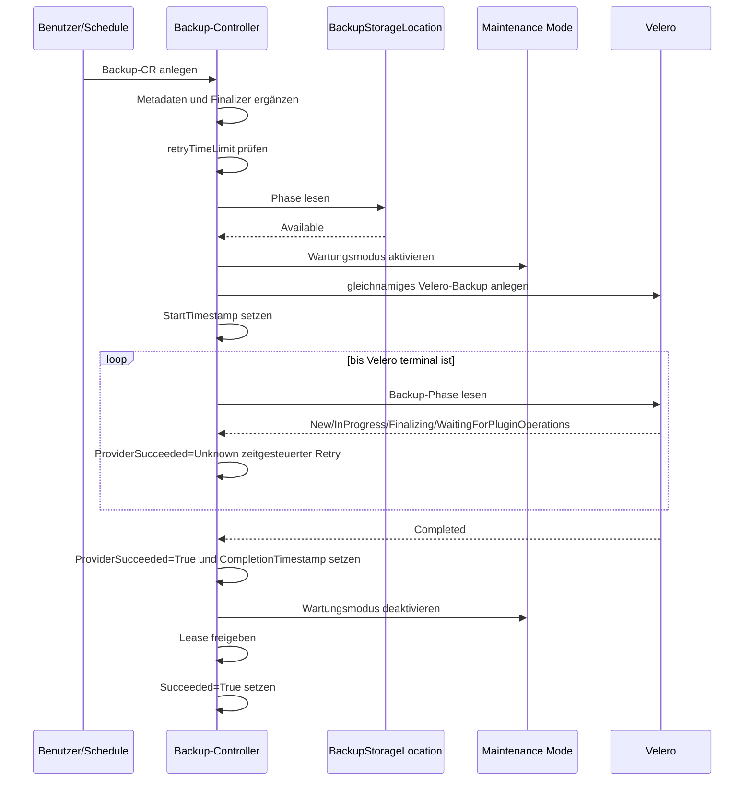
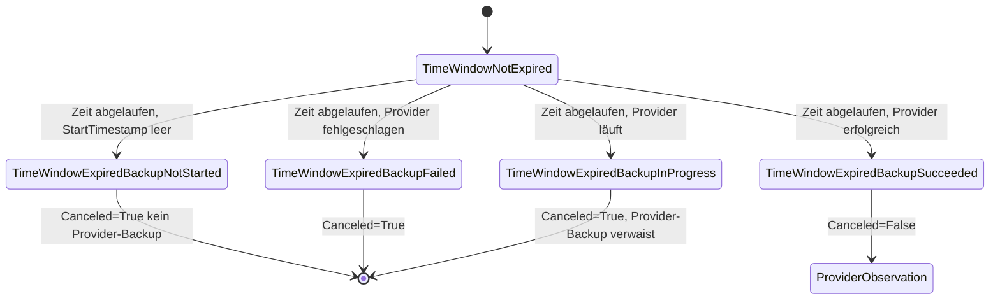
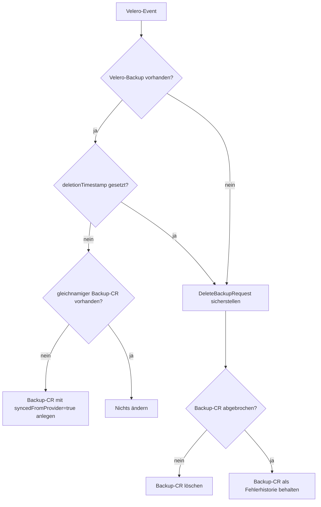
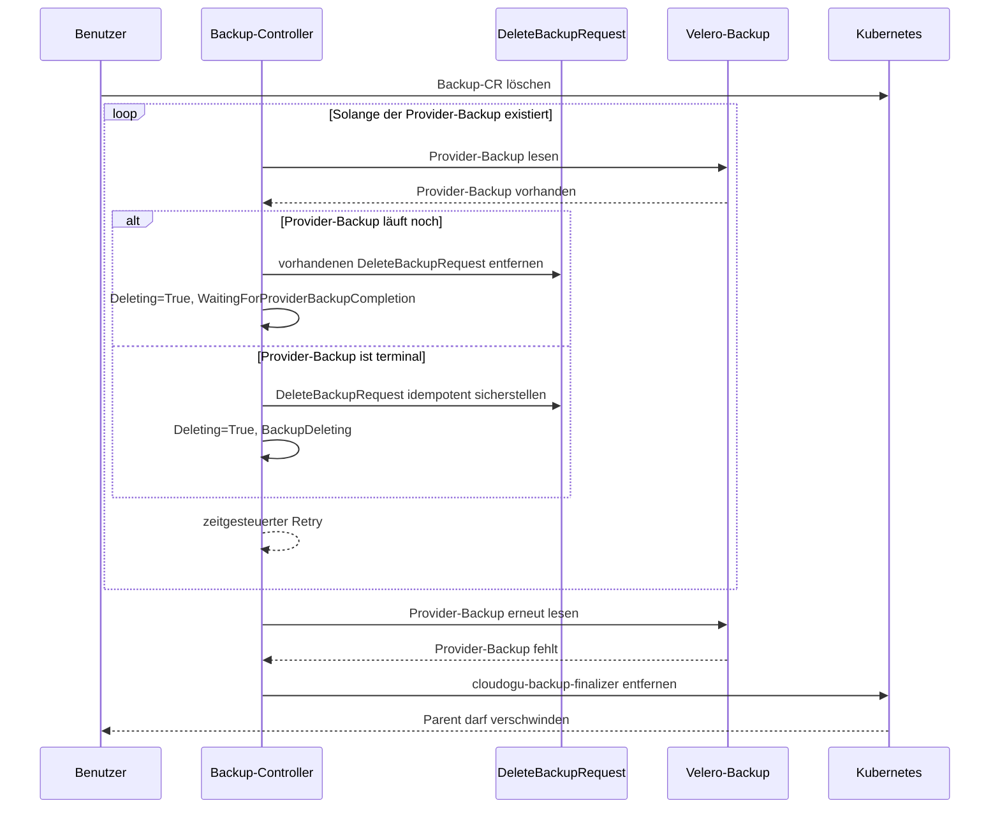

# Backup-Prozess

Diese Dokumentation beschreibt den Backup-Workflow des `k8s-backup-operator` aus Entwicklersicht.

Der Backup-Bereich besteht aus zwei Controllern:

- Der **Backup-Controller** verarbeitet `k8s.cloudogu.com/v1`-`Backup`-Ressourcen, prüft Voraussetzungen, aktiviert den Wartungsmodus, erstellt und beobachtet das Provider-Backup und wickelt Löschungen ab.
- Der **Velero-Backup-Synchronisationscontroller** beobachtet Velero-`Backup`-Ressourcen. Er erzeugt fehlende CES-Backup-CRs für bereits beim Provider vorhandene Backups und koppelt Löschungen in beide Richtungen.

Der derzeit konkret implementierte Provider ist Velero. CES-Backup und Velero-Backup verwenden denselben Namen und Namespace.

## Controller-Steuerung

Der Backup-Controller wählt abhängig vom Zustand des Backup-CR eine operationsspezifische Liste von `ensure...`-Methoden aus. Jede Stage liefert eine Aktion:

| Aktion | Bedeutung |
|---|---|
| `Next` | Die nächste Stage läuft im selben Reconcile. |
| `Retry` | Der Reconcile endet mit dem konfigurierten `requeueAfter`. |
| `Abort` | Der Reconcile endet ohne explizites Requeue. |

Ein gleichzeitig zurückgegebener Fehler wird an `controller-runtime` weitergereicht und löst dessen Backoff aus. Der Requeue-Abstand stammt aus `operatorConfig.RequeueTimeSeconds`.

Anders als der Restore-Controller verwendet der Backup-Controller einen Event-Filter. Reconciles werden bei einer geänderten `generation` sowie beim erstmaligen Setzen des `deletionTimestamp` ausgelöst. Reine Statusänderungen des Backup-CR lösen über diesen Controller kein weiteres Event aus. Das Warten auf Provider-Fortschritt erfolgt deshalb über `Retry` und nicht über einen Watch auf owned Children. Owned Children waren hier nie eine Option: Ein Velero-Backup kann bereits existieren, bevor es die CES-`Backup`-CR gibt, unsere CR kann also nicht Veleros Owner sein.

## Stage-Reihenfolge

Der `deletionTimestamp` hat Vorrang vor allen Conditions. Ohne Löschanforderung werden Backups mit terminalem `Succeeded` in den Ignore-Pfad geleitet; ein terminales `ProviderSucceeded` oder `Canceled=True` führt in den Finalize-Pfad. Alle übrigen Backups durchlaufen den folgenden Create-Pfad:

1. `ensureVeleroStatusSynced`
2. `ensureBackupSetup`
3. `ensureBackupIsCanceledAfterTimeWindowExpired`
4. `ensureBackupIsPrepared`
5. `ensureActiveBackupLease`
6. `ensureMaintenanceActivated`
7. `ensureProviderBackupCreated`
8. `ensureProviderBackupCompleted`
9. `ensureMaintenanceDeactivated`
10. `ensureBackupLeaseReleased`
11. `ensureBackupRunCompleted`

Hat der Provider bereits ein terminales Ergebnis geliefert oder wurde das Backup abgebrochen, verwendet der Controller den Finalize-Pfad mit den letzten drei Stages. Bei einer Löschung laufen `ensureMaintenanceDeactivated`, `ensureBackupLeaseReleased` und `ensureProviderBackupDeleted`. Ein bereits terminales Backup mit `Succeeded=True` oder `Succeeded=False` verwendet den Ignore-Pfad mit `ensureOrphanedBackupDeleted`: Die Stage prüft, ob der Provider-Backup noch existiert, und entfernt gegebenenfalls einen verwaisten CES-Backup-CR. Abgebrochene Backups sind dort ausgenommen und werden stattdessen von `ensureCanceledProviderBackupDeleted` behandelt (siehe [Zeitfenster und Abbruch](#zeitfenster-und-abbruch)). `Succeeded` wird erst durch `ensureBackupRunCompleted` nach Maintenance-Deaktivierung und Lease-Freigabe gesetzt.

## Erfolgreicher lokaler Backup-Ablauf



### Setup und Metadaten

`ensureBackupSetup` setzt folgende Metadaten:

- Labels `app=ces` und `k8s.cloudogu.com/part-of=backup`
- Finalizer `cloudogu-backup-finalizer`
- Annotation `backup.cloudogu.com/blueprintId` mit dem Display-Namen des ersten Blueprints im Namespace
- Annotation `backup.cloudogu.com/dogus` mit dessen Dogu-Liste als JSON

Existiert kein Blueprint, läuft der Workflow ohne Blueprint-Annotationen weiter. Andere Fehler beim Listen oder Serialisieren brechen den Reconcile mit Fehler ab. Vorhandene fremde Labels, Annotationen und Finalizer bleiben erhalten; verwaltete Werte werden bei Abweichung korrigiert.

### Zeitfenster und Abbruch

Die ConfigMap `k8s-backup-operator-backup-config` muss im Backup-Namespace den Schlüssel `retryTimeLimit` enthalten. Der Wert ist eine Ganzzahl in Minuten. Das Zeitfenster ist abgelaufen, wenn gilt:

```text
now - metadata.creationTimestamp > retryTimeLimit * time.Minute
```



Fehlt die ConfigMap oder der Schlüssel, oder ist der Wert nicht numerisch, endet der Reconcile mit Fehler. `StartTimestamp` ist die Grenze zwischen „noch nicht gestartet“ und „bereits gestartet“.

#### Abbruch eines laufenden Provider-Backups

Velero bietet keine Möglichkeit, ein laufendes Backup von außen abzubrechen. Der Lauf wird daher nicht gestoppt, sondern aufgegeben: `Canceled=True` leitet den nächsten Durchlauf in den Finalize-Pfad, der den Wartungsmodus deaktiviert, das Lease freigibt und das terminale `Succeeded=False` schreibt. Das Velero-Backup läuft als Waise weiter. Wartungsmodus und Lease stundenlang über das Zeitfenster hinaus zu halten, ist das schlechtere Ergebnis.

`ensureCanceledProviderBackupDeleted` löscht diese Waise, sobald sie nicht mehr in einer laufenden Phase ist. Der Wartungsmodus wurde abgeschaltet, während Velero möglicherweise noch gelesen hat; das Ergebnis ist daher potenziell inkonsistent und darf nicht wiederherstellbar sein – auch nicht von einem anderen Cluster, das dieselbe `BackupStorageLocation` nutzt. Der Backup-CR selbst bleibt als Fehlerhistorie erhalten, deshalb überspringen sowohl `ensureOrphanedBackupDeleted` als auch der Synchronisations-Controller abgebrochene Backups.

Die Löschung läuft auf dem bereits terminalen CR: `ensureBackupRunCompleted` gibt für abgebrochene Läufe `Retry` zurück, und die gemeinsam genutzten Lösch-Helfer schreiben ihren Fortschritt mit `Deleting=False`, da nur das Provider-Backup gelöscht wird, nicht der CR.

### Vorbereitung

`ensureBackupIsPrepared` liest die konfigurierte Velero-`BackupStorageLocation`. Nur `status.phase=Available` ergibt `Prepared=True`. Eine fehlende oder nicht verfügbare Location ergibt `Prepared=False` und einen kontrollierten Retry. Andere API-Fehler werden zurückgegeben.

Zusätzlich listet die Stage die Velero-Backups des Namespace und blockiert mit `Prepared=False`/`OtherProviderBackupInProgress`, solange ein Velero-Backup eines anderen Laufs noch in einer laufenden Phase ist. Das verhindert, dass ein neues Backup mit dem Backup eines abgebrochenen Laufs kollidiert. Der Guard läuft vor Lease und Wartungsmodus, das Warten hat also keine Auswirkung auf Benutzer – ein kurz nach einem Abbruch gestartetes Backup kann aber in sein eigenes Timeout laufen und ebenfalls abgebrochen werden.

### Gemeinsames Backup-/Restore-Lease

Nach erfolgreicher Vorbereitung und vor der Aktivierung des Wartungsmodus beansprucht `ensureActiveBackupLease` das namespaceweite Kubernetes-`Lease` `k8s-backup-operator-lease`. Dasselbe Lease verwendet der Restore-Controller. Backup und Restore können ihre kritischen Abschnitte im selben Namespace dadurch nicht gleichzeitig ausführen.

Der Holder wird durch `spec.holderIdentity` (UID), `k8s.cloudogu.com/backup-operator-lease-holder-name` (Name) und `k8s.cloudogu.com/lease-holder-kind` (`Backup` oder `Restore`) beschrieben. Alle drei Felder werden gemeinsam geschrieben und müssen vorhanden sein; unvollständige Leases gelten als ungültig und werden nicht heuristisch repariert. Jeder Controller registriert nur den Resolver für seinen eigenen Ressourcentyp. Ein gesetzter fremder oder unbekannter Holder-Typ wird als aktiv behandelt und nicht übernommen; die beiden Workflows müssen sich daher nicht gegenseitig kennen. Ein eigenes Lease wird idempotent akzeptiert. Zeitablauf allein macht ein Lease nicht stale.

`ensureBackupLeaseReleased` läuft im Finalize- und Delete-Pfad nach `ensureMaintenanceDeactivated`. Die Stage löscht ausschließlich das eigene Lease, wenn der Backup-Lauf terminal, abgebrochen oder zum Löschen markiert ist. Für laufende Backups und fremde Holder ist sie ein No-op. UID- und `resourceVersion`-Preconditions verhindern, dass ein inzwischen neu vergebenes Lease gelöscht wird. Die Stage ändert bewusst nicht den Wartungsmodus; dafür bleibt `ensureMaintenanceDeactivated` zuständig.

### Wartungsmodus

Vor dem Erstellen des Velero-Backups muss der Wartungsmodus aktiv sein. Der Controller aktiviert ihn mit:

```text
Title: Service temporary unavailable
Text:  Backup in progress
force: false
```

Nach einem terminal erfolgreichen oder fehlgeschlagenen Provider-Backup wird ein noch aktiver Wartungsmodus deaktiviert. Aktivierung und Deaktivierung sind nicht best-effort; Fehler werden zurückgegeben.

Die Reihenfolge ist relevant: Ein terminales Provider-Ergebnis versetzt den Backup in den Finalize-Pfad. Dort wird zuerst der Wartungsmodus deaktiviert, danach das Lease freigegeben und erst anschließend `Succeeded` durch `ensureBackupRunCompleted` gesetzt. Schlägt die Deaktivierung fehl, bleibt der Backup dadurch nicht fälschlich als vollständig abgeschlossen markiert und der Finalize-Pfad wird erneut ausgeführt.

### Erzeugtes Velero-Backup

Der Operator erzeugt ein gleichnamiges Velero-Backup mit:

- genau dem Namespace des Backup-CR
- Storage Location aus der Operator-Konfiguration
- TTL `87660h`, ungefähr zehn Jahre
- `defaultVolumesToFsBackup=false`
- CES-Standardlabels und weitergereichten Backup-Annotationen

Enthaltene Ressourcentypen:

- `configmaps`
- `secrets`
- `persistentvolumeclaims`
- `persistentvolumes`
- `dogus.k8s.cloudogu.com`

Die Auswahl ist eine ODER-Verknüpfung aus:

1. `k8s.cloudogu.com/type=global-config`
2. Existenz des Labels `dogu.name`
3. Existenz des Labels `k8s.cloudogu.com/backup-scope`

Die Werte von `dogu.name` und `backup-scope` werden für die Auswahl nicht ausgewertet. Zusätzliche Ressourcen sind nur enthalten, wenn ihr Ressourcentyp zugleich in der obigen Include-Liste steht.

### Provider-Phasen

| Kategorie | Velero-Phasen | Ergebnis |
|---|---|---|
| laufend | `New`, `InProgress`, `Finalizing`, `FinalizingPartiallyFailed`, `WaitingForPluginOperations`, `WaitingForPluginOperationsPartiallyFailed` | `ProviderSucceeded=Unknown/ProviderBackupInProgress`, Retry |
| fehlgeschlagen | `FailedValidation`, `PartiallyFailed`, `Failed` | `ProviderSucceeded=False/ProviderBackupFailed` |
| erfolgreich | `Completed` | `ProviderSucceeded=True/ProviderBackupSucceeded` |
| nicht erwartet | beispielsweise `Deleting` | Fehler; kein impliziter Erfolg |

Beim Anlegen des Provider-Backups wird `StartTimestamp` nur gesetzt, wenn er noch leer ist. Beim terminalen Ergebnis wird `CompletionTimestamp` ebenfalls nur einmal gesetzt.

## Conditions

Lokale und aus dem Provider importierte Backups verwenden dieselben fünf Conditions:

### `Deleting`

| Status | Reason | Bedeutung |
|---|---|---|
| `False` | `BackupNotDeleting` | Kein `deletionTimestamp`; normaler Workflow darf laufen. |
| `True` | `BackupDeleting` | Löschen wurde angefordert und der Provider-Backup existiert noch. |
| `False` | `CanceledProviderBackupDeleted` | Das verwaiste Provider-Backup eines abgebrochenen Laufs ist weg. |

Während das Provider-Backup eines abgebrochenen Laufs gelöscht wird, werden die Lösch-Reasons mit Status `False` geschrieben: Der CR bleibt erhalten.

### `Canceled`

| Status | Reason | Bedeutung |
|---|---|---|
| `False` | `TimeWindowNotExpired` | Startzeitfenster ist noch offen; der Backup wurde nicht abgebrochen. |
| `True` | `TimeWindowExpiredBackupNotStarted` | Backup wurde vor Ablauf nicht gestartet. |
| `True` | `TimeWindowExpiredBackupInProgress` | Backup lief beim Ablauf noch; sein Provider-Backup verwaist und wird gelöscht. |
| `True` | `TimeWindowExpiredBackupFailed` | Provider war beim Ablauf bereits fehlgeschlagen. |
| `False` | `TimeWindowExpiredBackupSucceeded` | Provider war beim Ablauf bereits erfolgreich. |

### `Prepared`

| Status | Reason | Bedeutung |
|---|---|---|
| `False` | `ProviderBackupStorageLocationNotFound` | BackupStorageLocation fehlt. |
| `False` | `ProviderBackupStorageLocationNotAvailable` | Location existiert, ist aber nicht `Available`. |
| `False` | `OtherProviderBackupInProgress` | Ein Provider-Backup eines anderen Laufs läuft noch. |
| `True` | `ProviderBackupStorageLocationAvailable` | Provider-Speicher ist verwendbar. |
| `True` | `VeleroStatusSynced` | Importierter Backup existiert bereits bei Velero. |

### `ProviderSucceeded`

| Status | Reason | Bedeutung |
|---|---|---|
| `Unknown` | `ProviderBackupInProgress` | Provider arbeitet; die Create-Pipeline wird zeitgesteuert erneut ausgeführt. |
| `Unknown` | `VeleroBackupRunning` | Ein importierter Velero-Backup ist noch nicht terminal. |
| `False` | `ProviderBackupFailed` | Provider ist terminal fehlgeschlagen; die Finalize-Pipeline übernimmt. |
| `False` | `VeleroBackupFailed` | Ein importierter Velero-Backup meldet eine bekannte Fehlerphase. |
| `True` | `ProviderBackupSucceeded` | Provider ist erfolgreich abgeschlossen; die Finalize-Pipeline übernimmt. |
| `True` | `VeleroStatusSynced` | Ein importierter Velero-Backup ist `Completed`. |

### `Succeeded`

| Status | Reason | Bedeutung                                                                                                               |
|---|---|-------------------------------------------------------------------------------------------------------------------------|
| `Unknown` | `MaintenanceModesIsNotActive` | Das Aktivieren des Wartungsmodus wurde angestossen, der Modus ist aber aktuell noch nicht aktiv; Workflow läuft weiter. |
| `Unknown` | `ProviderBackupResourceDoesNotExist` | Provider-Child wurde gerade erzeugt.                                                                                    |
| `Unknown` | `VeleroBackupRunning` | Ein importierter Velero-Backup ist noch nicht terminal; unbekannte Phasen gelten ebenfalls als laufend.                 |
| `False` | `ProviderBackupFailed` | Provider ist terminal fehlgeschlagen.                                                                                   |
| `False` | `VeleroBackupFailed` | Ein importierter Velero-Backup meldet eine bekannte Fehlerphase.                                                        |
| `True` | `ProviderBackupSucceeded` | Provider ist erfolgreich abgeschlossen.                                                                                 |
| `True` | `VeleroStatusSynced` | Ein importierter Velero-Backup ist `Completed`.                                                                         |

`Succeeded=True` und `Succeeded=False` werden von `requiredOperation` als terminal eingestuft und in den Ignore-Pfad geleitet. Der Name `MaintenanceModesIsNotActive` beschreibt historisch den Zustand vor der erfolgreichen Aktivierung.

Für `spec.syncedFromProvider=true` schreibt `ensureVeleroStatusSynced` den beobachteten Zustand ebenfalls in `Succeeded`. `WaitingForPluginOperationsPartiallyFailed` und `FinalizingPartiallyFailed` bleiben dabei nicht-terminal, weil Velero noch Plugin- beziehungsweise Finalisierungsarbeiten ausführt; erst die spätere terminale Phase `PartiallyFailed` setzt `Succeeded=False`. Zusätzlich werden Velero-Zeitstempel gespiegelt. Das Legacy-Feld `status.status` wird wie bei lokalen Backups zentral vom `conditionsUpdater` aus den Conditions abgeleitet.

## Velero-Backup-Synchronisierung

Der Synchronisationscontroller sorgt dafür, dass Provider- und CES-Katalog konvergieren:



Ein importierter Backup-CR erhält Provider `velero`, CES-Standardlabels, weitergereichte Annotationen und den Backup-Finalizer. Da Kubernetes beim Create keinen Status aus dem Objekt übernimmt, signalisiert `spec.syncedFromProvider=true` dem Hauptcontroller, den Status anschließend aus Velero zu lesen.

Wenn ein Velero-Backup gelöscht wird oder bereits fehlt, stellt der Controller zuerst idempotent einen gleichnamigen `DeleteBackupRequest` sicher und löscht danach den CES-Backup-CR – es sei denn, dieser ist abgebrochen, dann bleibt er als Fehlerhistorie erhalten. Der DeleteRequest verhindert, dass Velero die CR später aus noch vorhandenen Storage-Daten erneut rekonstruiert.

## Delete-Workflow eines Backup-CR



Bei laufenden Velero-Phasen (`New`, `InProgress`, `Finalizing` und den Phasen für ausstehende Plugin-Operationen) legt der Controller noch keinen DeleteRequest an. Einen bereits vorhandenen DeleteRequest entfernt er, damit Velero das laufende Backup regulär abschließen kann. Die Condition `Deleting=True` mit Reason `WaitingForProviderBackupCompletion` macht diesen Wartezustand sichtbar. Erst bei einem nicht mehr laufenden Provider-Backup wird der DeleteRequest sichergestellt.

Der Controller wartet nicht auf den Status des DeleteRequests, sondern prüft bei jedem Retry, ob der Velero-Backup noch existiert. Erst nach dessen Verschwinden wird der Backup-Finalizer aus der Finalizer-Liste entfernt und der Parent aktualisiert. Andere Finalizer bleiben erhalten.

## Status-Persistenz und Idempotenz

Condition-Änderungen werden zentral über den `conditionsUpdater` mit einem Status-`MergeFrom`-Patch geschrieben. Dabei wird auch das von externen Systemen verwendete Legacy-Feld `status.status` bei lokalen und importierten Backups synchronisiert:

| Condition-Zustand | `status.status` |
|---|---|
| laufender Workflow oder nicht-terminale Condition | `in progress` |
| `Succeeded=True` | `completed` |
| `Succeeded=False` oder `Canceled=True` | `failed` |
| `Deleting=True` | `deleting` |
| noch keine Condition | bisheriger Wert, bei einem neuen Backup also leer |

`Deleting=True` hat Vorrang vor terminalen Erfolgs- oder Fehlerconditions. 

`meta.SetStatusCondition` erhält bei unverändertem Status die vorhandene Transition-Zeit. 
Status und Conditions werden nur bei tatsächlicher Abweichung aktualisiert. 

## Acceptance-Tests

Die Cluster-Tests liegen in `acceptance-tests/backup_test.go` und tragen das Ginkgo-Label `backup`:

```bash
K8S_TEST_CLUSTER_KUBECONFIG=/absoluter/pfad/kubeconfig \
  make acceptance-test GINKGO_LABEL_FILTER=backup
```
