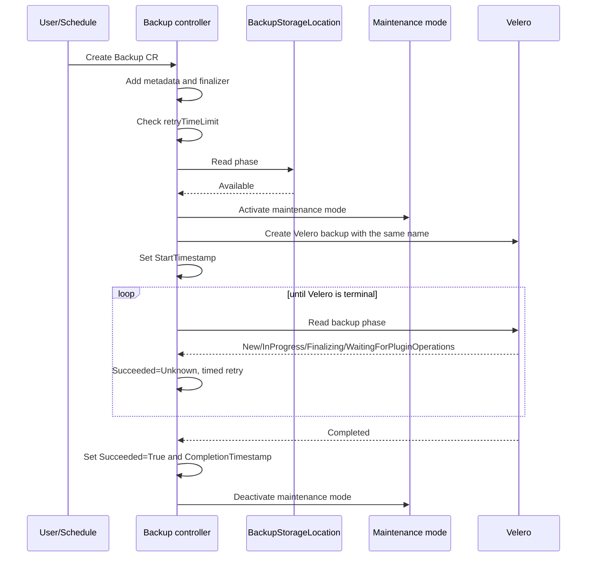
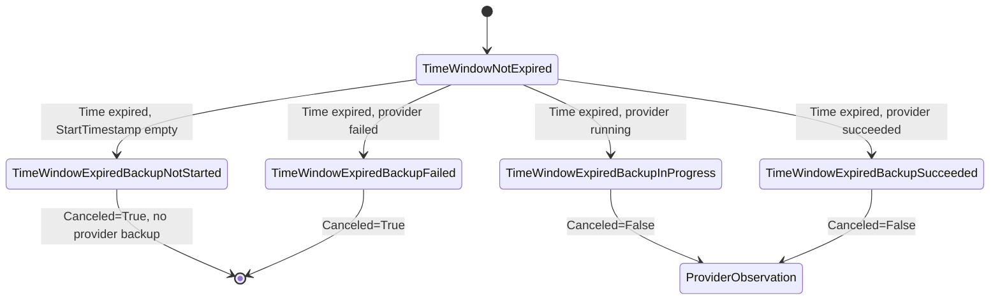
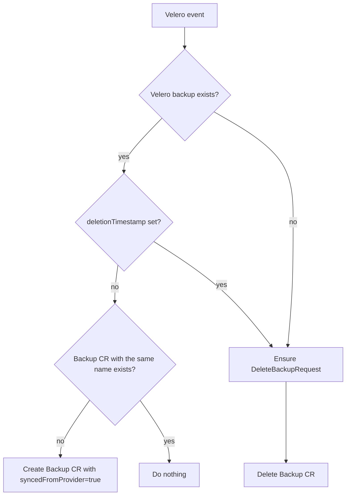
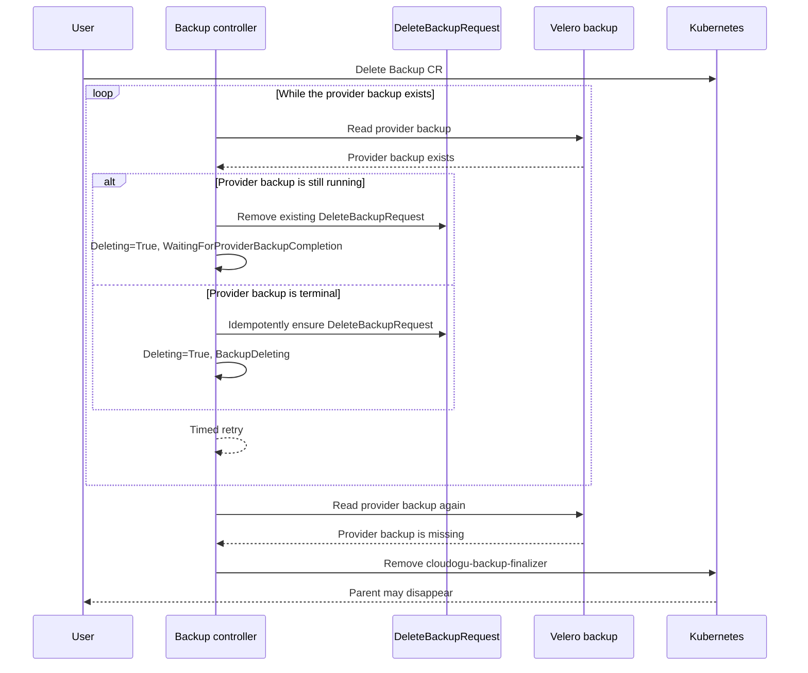

# Backup process

This documentation describes the `k8s-backup-operator` backup workflow from a developer's perspective.

The backup area consists of two controllers:

- The **backup controller** processes `k8s.cloudogu.com/v1` `Backup` resources, checks prerequisites, activates maintenance mode, creates and observes the provider backup, and handles deletions.
- The **Velero backup synchronization controller** observes Velero `Backup` resources. It creates missing CES backup CRs for backups that already exist at the provider and links deletions in both directions.

The provider currently implemented is Velero. CES backups and Velero backups use the same name and namespace.

## Controller flow

The backup controller executes a fixed list of `ensure...` methods. Each stage returns an action:

| Action | Meaning |
|---|---|
| `Next` | The next stage runs during the same reconciliation. |
| `Retry` | The reconciliation ends with the configured `requeueAfter`. |
| `Abort` | The reconciliation ends without an explicit requeue. |

An error returned at the same time is passed to `controller-runtime` and triggers its backoff. The requeue interval comes from `operatorConfig.RequeueTimeSeconds`.

Unlike the restore controller, the backup controller uses an event filter. Reconciliations are triggered when the `generation` changes and when the `deletionTimestamp` is set for the first time. Changes limited to the status of the backup CR do not trigger another event through this controller. Waiting for provider progress therefore uses `Retry` instead of watching owned children.

## Stage order

The methods run in the following order:

1. `ensureBackupLeaseReleased` - Release the resource's own lease for a terminal or deleted backup - clean up existing backup leases
2. `ensureProviderBackupDeleted` - Handle provider backup deletion
3. `ensureVeleroStatusSynced` - Synchronize status imported from Velero
4. `ensureCompletedBackupIsIgnored` - Ignore a terminal local backup
5. `ensureBackupSetup` - Ensure labels, blueprint annotations, and finalizer
6. `ensureBackupIsCanceledAfterTimeWindowExpired` - Check the time window
7. `ensureBackupIsPrepared` - Check the `BackupStorageLocation`
8. `ensureActiveBackupLease` - Acquire the shared backup/restore lease
9. `ensureMaintenanceActivated` - Activate maintenance mode
10. `ensureProviderBackupCreated` - Ensure the Velero backup
11. `ensureProviderBackupCompleted` - Observe the Velero phase
12. `ensureMaintenanceDeactivated` - Deactivate maintenance mode
13. `ensureBackupLeaseReleased` - Release the resource's own lease after a successful backup - clean up its own backup lease

Lease release is placed first so that terminal backups and backups being deleted reach it before an `Abort` or `Retry`. It does not change maintenance mode; only `ensureMaintenanceDeactivated` is responsible for that.

## Successful local backup workflow



### Setup and metadata

`ensureBackupSetup` sets the following metadata:

- Labels `app=ces` and `k8s.cloudogu.com/part-of=backup`
- Finalizer `cloudogu-backup-finalizer`
- Annotation `backup.cloudogu.com/blueprintId` containing the display name of the first blueprint in the namespace
- Annotation `backup.cloudogu.com/dogus` containing its Dogu list as JSON

If no blueprint exists, the workflow continues without blueprint annotations. Other errors while listing or serializing abort the reconciliation with an error. Existing foreign labels, annotations, and finalizers are preserved; managed values are corrected when they differ.

### Time window and cancellation

The `k8s-backup-operator-backup-config` ConfigMap must contain the `retryTimeLimit` key in the backup namespace. Its value is an integer in minutes. The time window has expired when:

```text
now - metadata.creationTimestamp > retryTimeLimit * time.Minute
```



If the ConfigMap or key is missing, or if the value is not numeric, the reconciliation ends with an error. `StartTimestamp` separates “not started yet” from “already started.”

### Preparation

`ensureBackupIsPrepared` reads the configured Velero `BackupStorageLocation`. Only `status.phase=Available` results in `Prepared=True`. A missing or unavailable location results in `Prepared=False` and a controlled retry. Other API errors are returned.

### Shared backup/restore lease

After successful preparation and before maintenance mode is activated, `ensureActiveBackupLease` acquires the namespace-wide Kubernetes `Lease` named `k8s-backup-operator-restore`. The restore controller uses the same lease. This prevents backup and restore from executing their critical sections concurrently in the same namespace.

The holder is described by `spec.holderIdentity` (UID), `k8s.cloudogu.com/backup-operator-lease-holder-name` (name), and `k8s.cloudogu.com/lease-holder-kind` (`Backup` or `Restore`). All three fields are written together and must be present; incomplete leases are considered invalid and are not repaired heuristically. Each controller only registers the resolver for its own resource type. A foreign or unknown holder type is considered active and is not taken over, so the two workflows do not need to know about each other. A resource's own lease is accepted idempotently. The passage of time alone does not make a lease stale.

`ensureBackupLeaseReleased` runs at the beginning of every reconciliation. The stage deletes only the resource's own lease when the backup is terminal (`Succeeded=True`, `Succeeded=False`, or `Canceled=True`) or marked for deletion. It is a no-op for running backups and foreign holders. UID and `resourceVersion` preconditions prevent deleting a lease that has since been assigned to another resource. The stage deliberately does not change maintenance mode; all terminal backup paths must ensure its deactivation themselves.

### Maintenance mode

Maintenance mode must be active before the Velero backup is created. The controller activates it with:

```text
Title: Service temporary unavailable
Text:  Backup in progress
force: false
```

After a terminal successful or failed provider backup, maintenance mode is deactivated if it is still active. Activation and deactivation are not best-effort; errors are returned.

The order is relevant: `ensureCompletedBackupIsIgnored` precedes the maintenance stages. Normal terminal provider evaluation sets `Succeeded` and invokes deactivation during the same reconciliation. If that exact deactivation fails, the next reconciliation already sees a terminal `Succeeded` condition and aborts earlier. Changes to this logic must explicitly account for this restart edge case.

### Generated Velero backup

The operator creates a Velero backup with the same name and the following settings:

- Exactly the namespace of the backup CR
- Storage location from the operator configuration
- TTL `87660h`, approximately ten years
- `defaultVolumesToFsBackup=false`
- CES standard labels and forwarded backup annotations

Included resource types:

- `configmaps`
- `secrets`
- `persistentvolumeclaims`
- `persistentvolumes`
- `dogus.k8s.cloudogu.com`

The selection is an OR combination of:

1. `k8s.cloudogu.com/type=global-config`
2. Presence of the `dogu.name` label
3. Presence of the `k8s.cloudogu.com/backup-scope` label

The values of `dogu.name` and `backup-scope` are not evaluated for selection. Additional resources are included only if their resource type is also in the include list above.

### Provider phases

| Category | Velero phases | Result |
|---|---|---|
| running | `New`, `InProgress`, `Finalizing`, `FinalizingPartiallyFailed`, `WaitingForPluginOperations`, `WaitingForPluginOperationsPartiallyFailed` | `Succeeded=Unknown/ProviderBackupInProgress`, retry |
| failed | `FailedValidation`, `PartiallyFailed`, `Failed` | `Succeeded=False/ProviderBackupFailed` |
| successful | `Completed` | `Succeeded=True/ProviderBackupSucceeded` |
| unexpected | for example `Deleting` | Error; no implicit success |

When the provider backup is created, `StartTimestamp` is set only if it is still empty. For a terminal result, `CompletionTimestamp` is likewise set only once.

## Conditions

Local backups and backups imported from the provider use the same four conditions:

### `Deleting`

| Status | Reason | Meaning |
|---|---|---|
| `False` | `BackupNotDeleting` | No `deletionTimestamp`; the normal workflow may run. |
| `True` | `BackupDeleting` | Deletion was requested and the provider backup still exists. |

### `Canceled`

| Status | Reason | Meaning |
|---|---|---|
| `False` | `TimeWindowNotExpired` | The start time window is still open; the backup was not canceled. |
| `True` | `TimeWindowExpiredBackupNotStarted` | The backup was not started before the window expired. |
| `False` | `TimeWindowExpiredBackupInProgress` | The backup was already running when the window expired and may continue. |
| `True` | `TimeWindowExpiredBackupFailed` | The provider had already failed when the window expired. |
| `False` | `TimeWindowExpiredBackupSucceeded` | The provider had already succeeded when the window expired. |

### `Prepared`

| Status | Reason | Meaning |
|---|---|---|
| `False` | `ProviderBackupStorageLocationNotFound` | The `BackupStorageLocation` is missing. |
| `False` | `ProviderBackupStorageLocationNotAvailable` | The location exists but is not `Available`. |
| `True` | `ProviderBackupStorageLocationAvailable` | Provider storage is usable. |
| `True` | `VeleroStatusSynced` | The imported backup already exists in Velero. |

### `Succeeded`

| Status | Reason | Meaning |
|---|---|---|
| `Unknown` | `MaintenanceModesIsNotActive` | Maintenance mode activation was initiated, but the mode is not active yet; the workflow continues. |
| `Unknown` | `ProviderBackupResourceDoesNotExist` | The provider child was just created. |
| `Unknown` | `ProviderBackupInProgress` | The provider is working. |
| `Unknown` | `VeleroBackupRunning` | An imported Velero backup is not terminal yet; unknown phases are also considered running. |
| `False` | `ProviderBackupFailed` | The provider failed terminally. |
| `False` | `VeleroBackupFailed` | An imported Velero backup reports a known failure phase. |
| `True` | `ProviderBackupSucceeded` | The provider completed successfully. |
| `True` | `VeleroStatusSynced` | An imported Velero backup is `Completed`. |

`Succeeded=True` and `Succeeded=False` are considered terminal by `ensureCompletedBackupIsIgnored`. The name `MaintenanceModesIsNotActive` historically describes the state before successful activation.

For `spec.syncedFromProvider=true`, `ensureVeleroStatusSynced` also writes the observed state to `Succeeded`. `WaitingForPluginOperationsPartiallyFailed` and `FinalizingPartiallyFailed` remain non-terminal because Velero is still performing plugin or finalization work; only the later terminal `PartiallyFailed` phase sets `Succeeded=False`. Velero timestamps are mirrored as well. As with local backups, the legacy `status.status` field is derived centrally from the conditions by the `conditionsUpdater`.

## Velero backup synchronization

The synchronization controller ensures that the provider and CES catalogs converge:



An imported backup CR receives provider `velero`, CES standard labels, forwarded annotations, and the backup finalizer. Because Kubernetes does not preserve status from the object during creation, `spec.syncedFromProvider=true` signals the main controller to read the status from Velero afterward.

When a Velero backup is deleted or is already missing, the controller first idempotently ensures a `DeleteBackupRequest` with the same name and then deletes the CES backup CR. The delete request prevents Velero from later reconstructing the CR from backup data that is still present in storage.

## Delete workflow of a Backup CR



For running Velero phases (`New`, `InProgress`, `Finalizing`, and the phases for pending plugin operations), the controller does not create a delete request yet. It removes an existing delete request so that Velero can finish the running backup normally. The `Deleting=True` condition with reason `WaitingForProviderBackupCompletion` makes this waiting state visible. The delete request is ensured only after the provider backup is no longer running.

The controller does not wait for the status of the delete request. Instead, it checks during every retry whether the Velero backup still exists. The backup finalizer is removed from the finalizer list and the parent is updated only after the provider backup has disappeared. Other finalizers are preserved.

## Status persistence and idempotency

Condition changes are written centrally by the `conditionsUpdater` using a status `MergeFrom` patch. The legacy `status.status` field used by external systems is synchronized for local and imported backups as well:

| Condition state | `status.status` |
|---|---|
| Running workflow or non-terminal condition | `in progress` |
| `Succeeded=True` | `completed` |
| `Succeeded=False` or `Canceled=True` | `failed` |
| `Deleting=True` | `deleting` |
| No condition yet | Previous value; empty for a new backup |

`Deleting=True` takes precedence over terminal success or failure conditions.

`meta.SetStatusCondition` preserves the existing transition time when the status is unchanged.
Status and conditions are updated only when they actually differ.

## Acceptance tests

The cluster tests are located in `acceptance-tests/backup_test.go` and use the Ginkgo label `backup`:

```bash
K8S_TEST_CLUSTER_KUBECONFIG=/absolute/path/to/kubeconfig \
  make acceptance-test GINKGO_LABEL_FILTER=backup
```
