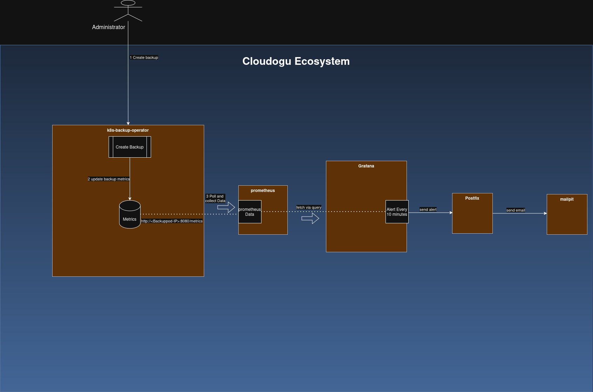

# Backup Monitoring Architecture

This document explains how the k8s-backup-operator component interacts with Prometheus, Grafana, Postfix and Mailpit(for local dev) to manage, monitor, and alert on backup/restore statuses.

## Architecture Overview
   Here is a diagram providing an overview of the process of sending alerts for the backup process.
   
## Component Workflows

### 1. k8s-backup-operator
* **Action**: Accepts request to trigger a backup.
* **Metrics Tracking**: Updates an internal Prometheus metric based on the outcome of the backup/restore
* Success: (e.g., backup_status_transitions_total{name="backup-20260708-1624",namespace="ecosystem",to="completed"} 4)
* Fail: (e.g., backup_status_transitions_total{name="backup-20260708-1624",namespace="ecosystem",to="failed"} 4).
* **Storage**: Stores metrics in memory locally.
* **Exposition**: Exposes these metrics on a `/metrics` HTTP endpoint on port 8080.

* Note: In order to let prometheus scrape the data, we need to set the following value:

`metrics.serviceMonitor.enabled=true`
This ensures that there is a service monitor : k8s-backup-operator-servicemonitor.
Through this service monitor,  prometheus knows through which pod the data can be accessed.

### 2. Prometheus
* **Action**: Acts as the central time-series database.
* **Scraping**: Periodically pulls data from the pod's `/metrics` endpoint.
* **Storage**: Saves the scraped state for historical querying.

### 3. Grafana

* **Action**: Evaluates the backup metrics using an alert rule that is configured in grafana (    ).
* **Schedule**: Runs every 10 minutes.
* **Logic**: Queries Prometheus. If the data has changed (indicating a new failure or success status), it triggers an alert instance.
* **Routing**: Forwards the alert notification to the configured SMTP contact point.

### 4. Mail Delivery (Postfix,  Mailpit)

#### Postfix
* **Role**: Production Mail Transfer Agent (MTA).
* **Action**: Grafana connects to Postfix via SMTP. Postfix routes and delivers the actual alert email to the recipient's external inbox.

#### Development: Mailpit
* **Role**: Local email testing tool.
* **Action**: Receives forwarded emails from Postfix, stores them safely in memory, and displays them in a local web dashboard for developer review.
