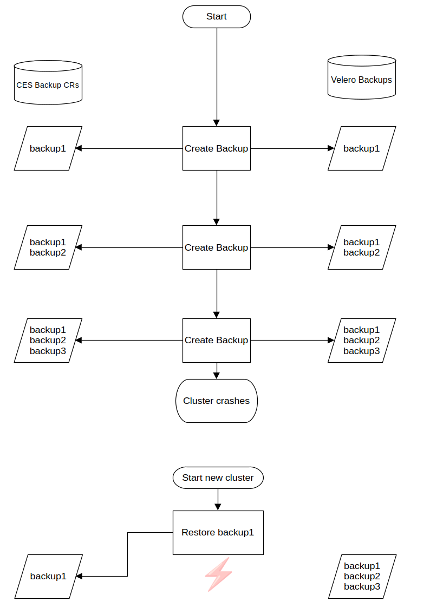
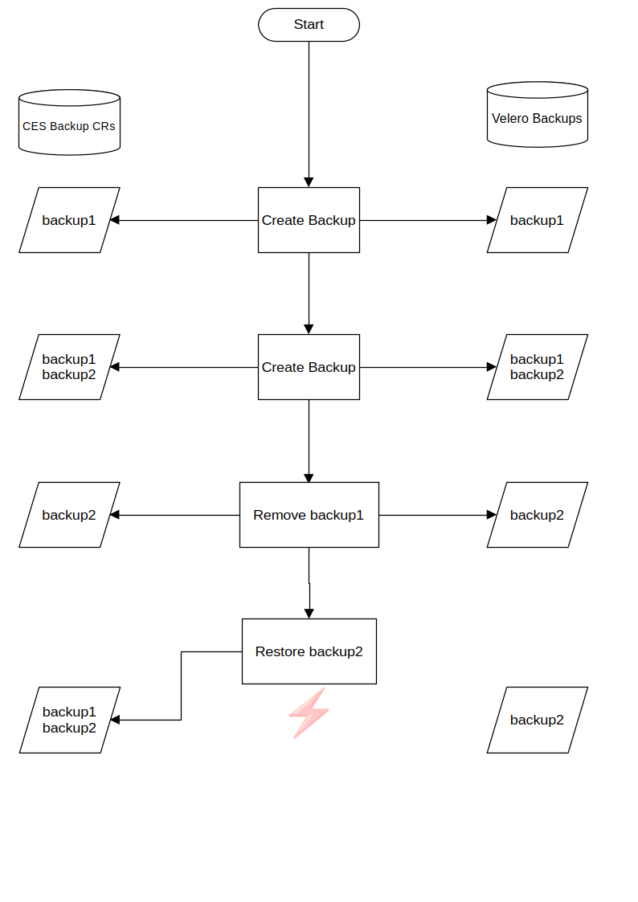

# Synchronisierung der Backups

Nachdem ein Restore im Cloudogu EcoSystem (CES) durchgeführt wurde, sind einige der Velero-Backups möglicherweise nicht mehr
als benutzerdefinierte Backup-Ressourcen (CRs) vorhanden. Dies gilt für Velero-Backups, die nach dem wiederhergestellten Backup
erstellt wurden.

Es kann auch vorkommen, dass ein Backup gelöscht wird, nachdem es in ein neueres Backup aufgenommen wurde, das anschließend wiederhergestellt wird.
Dies führt zu einem Backup-CR innerhalb des Clusters, der auf ein Velero-Backup verweist, das nicht mehr existiert.

Die Lösung hierfür ist die Synchronisierung der Velero-Backups mit den Backup-CRs, nachdem eine Wiederherstellung durchgeführt wurde.
Bei diesem Vorgang werden Backup-CRs für Velero-Backups erstellt, die im Cluster fehlen. Außerdem werden Backup-CRs gelöscht,
für die kein entsprechendes Velero-Backup vorhanden ist.