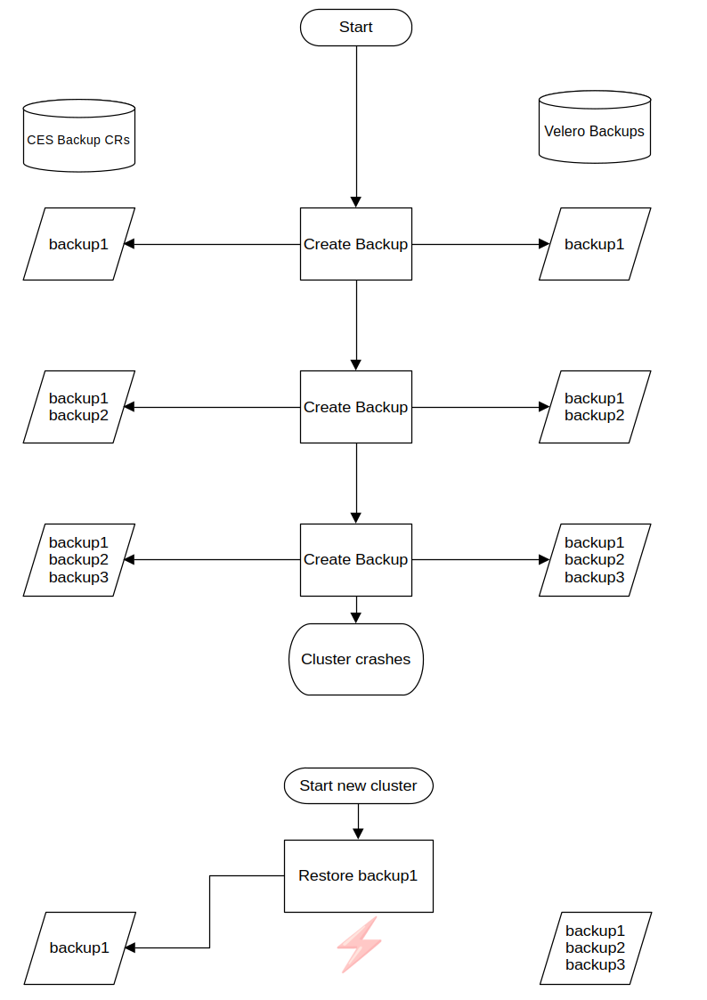
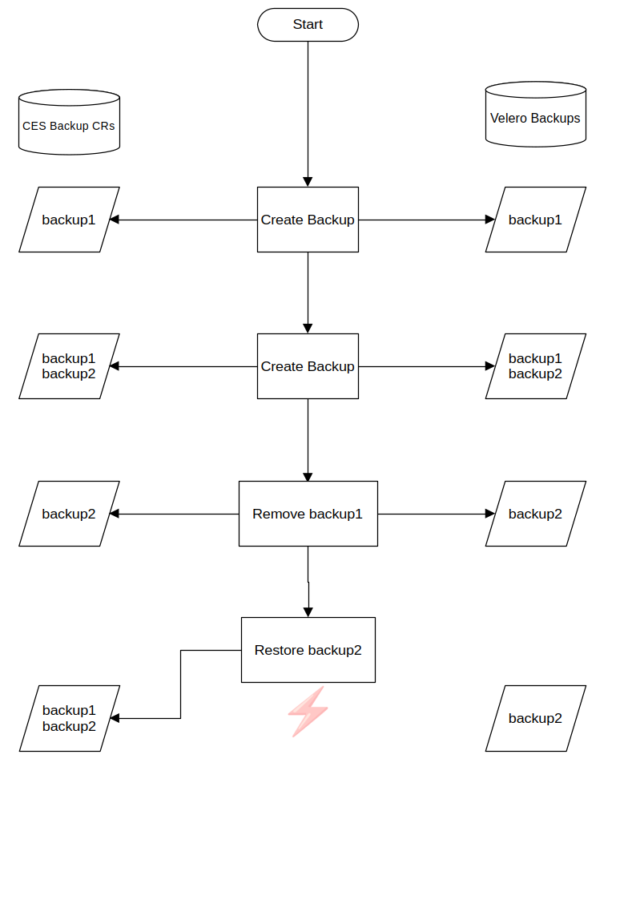

# Backup Synchronization

After a restore was applied to the Cloudogu EcoSystem (CES), some of the Velero backups may have no representation
as Backup Custom Resources (CRs) anymore. This applies to Velero backups which have been created after the backup that
was restored.

There is also the case that a Backup is deleted after it has been included in a newer Backup, which then is restored.
This leads to a Backup CR inside the cluster which refers to a Velero backup that doesn't exist anymore.

The solution to this is the synchronization of the Velero backups with the Backup CRs after a restore has been applied.
This process will create Backup CRs for Velero backups which are missing in the cluster. It will also delete Backup CRs,
which have no corresponding Velero backup.