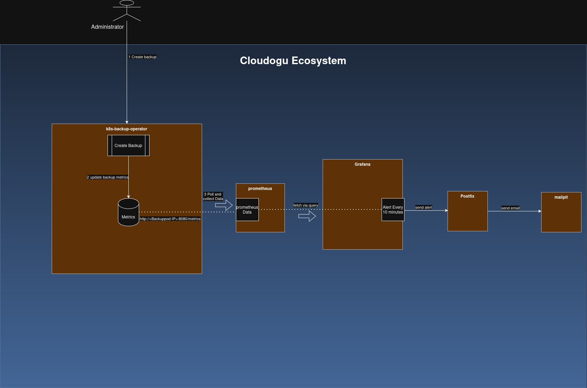

# Backup Operator Mailversand

In diesem Dokument wird erläutert, wie die Komponente „k8s-backup-operator“ mit Prometheus, Grafana, Postfix und Mailpit (für die lokale Entwicklung) zusammenarbeitet, um den Status von Backups und Restore zu verwalten, zu überwachen und entsprechende Warnmeldungen zu versenden.

## Architecture Overview

Hier ist ein Diagramm, das einen Überblick über den Ablauf der Benachrichtigungen im Rahmen des Sicherungsvorgangs gibt.
   
## Komponenten-Workflows

### 1. k8s-backup-operator
* **Aktion**: Akzeptiert die Anforderung, ein Backup auszulösen.
* **Metrik-Tracking**: Aktualisiert eine interne Prometheus-Metrik basierend auf dem Ergebnis der Backup/Restore
  * Erfolg: (z. B. backup_status_transitions_total{name=„backup-20260708-1624“,namespace=‚ecosystem‘,to=„completed“} 4)
  * Fehler: (z. B. backup_status_transitions_total{name=„backup-20260708-1624“,namespace=‚ecosystem‘,to=„failed“} 4).
* **Speicherung**: Speichert Metriken lokal im Arbeitsspeicher.
* **Bereitstellung**: Stellt diese Metriken über einen HTTP-Endpunkt `/metrics` auf Port 8080 bereit.

 Hinweis: Damit Prometheus die Daten erfassen kann, müssen wir den folgenden Wert festlegen:

`metrics.serviceMonitor.enabled=true`
Dadurch wird sichergestellt, dass ein Service-Monitor vorhanden ist: k8s-backup-operator-servicemonitor.
Über diesen Service-Monitor weiß Prometheus, über welchen Pod auf die Daten zugegriffen werden kann.

### 2. Prometheus
* **Action**: Dient als zentrale Zeitreihendatenbank.
* **Scraping**: Ruft in regelmäßigen Abständen Daten vom Endpunkt `/metrics` des Pods ab.
* **Storage**: Speichert den erfassten Status für historische Abfragen.

### 3. Grafana

* **Aktion**: Auswerten der Backup-Metriken mithilfe einer in Grafana konfigurierten Alarmregel ([backupalerts.yaml](https://github.com/cloudogu/grafana/blob/develop/resources/default-provisioning/alerting/backupalerts.yaml)).
* **Zeitplan**: Wird alle 10 Minuten ausgeführt.
* **Logik**: Fragt Prometheus ab. Wenn sich die Daten geändert haben (was auf einen neuen Fehler- oder Erfolgszustand hindeutet), löst dies eine Alarminstanz aus.
* **Weiterleitung**: Leitet die Alarmbenachrichtigung an den konfigurierten SMTP-Kontakt weiter.

### 4. E-Mail-Zustellung (Postfix, Mailpit)

#### Postfix
* **Rolle**: Mail Transfer Agent (MTA) in der Produktionsumgebung.
* **Funktion**: Grafana stellt über SMTP eine Verbindung zu Postfix her. Postfix leitet die eigentliche Benachrichtigungs-E-Mail weiter und stellt sie im externen Posteingang des Empfängers zu.

#### Entwicklung: Mailpit
* **Rolle**: Lokales E-Mail-Testtool.
* **Funktion**: Empfängt weitergeleitete E-Mails von Postfix, speichert sie sicher im Arbeitsspeicher und zeigt sie in einem lokalen Web-Dashboard zur Überprüfung durch die Entwickler an.

## Testen des E-Mail-Versands für Backup & Restore

Um die E-Mail-Zustellung für Backup und Restore zu testen, muss Mailpit im Cluster bereitgestellt werden.

### Cluster vorbereiten

Wir gehen hier von einem Cluster mit konfiguriertem Backup aus, das heißt der `k8s-backup-operator` sowie die
`k8s-backup-operator-crd` sind verfügbar und Velero ist konfiguriert.

Um das Sammeln der Metriken durch Prometheus zu aktivieren, muss der ServiceMonitor für Prometheus im
Backup-Operator aktiviert werden. Dies geht über die valuesYamlOverwrite beim Installieren des Operators mit:

```yaml
  valuesYamlOverwrite: |
    metrics:
      serviceMonitor:
        enabled: true
```

Zusätzlich müssen folgende Komponenten installiert werden:

- Prometheus als Datenquelle
- Grafana

Wird auf einem Coder-Cluster gearbeitet, muss bei der Dogu-CR von Grafana noch das Label `dogu.name=grafana`
ergänzt werden.

### Mailpit

Zum Testen der E-Mails wird Mailpit verwendet. Dafür müssen vier Ressourcen angelegt werden: ein Deployment, ein Service,
ein Ingress und eine NetworkPolicy. Die Datei [mailpit.yaml](k8s-resources/mailpit.yaml) beinhaltet alles Notwendige und kann im Cluster
angewendet werden. Sie befindet sich im Verzeichnis `k8s-resources`. Der Namespace muss dabei auf `ecosystem` gesetzt
sein.

Danach die ConfigMap von Postfix editieren und den Wert `relayhost` auf

`relayhost: "[mailpit.ecosystem.svc.cluster.local]:1025"`

setzen.

Nun für den Mailpit-Pod einen Port-Forward für den Port 8025 einrichten. Dies geht zum Beispiel unter k9s mit
der Tastenkombination ``Shift+F`` oder über die Kommandozeile mit

```shell
kubectl port-forward -n ecosystem pods/mailpit 8025:8025
```

Nun sollte die UI unter <http://localhost:8025> erreicht werden können.

### Mailversand testen

In Grafana können unter Meldungen/Kontaktpunkte die Benachrichtigungsrichtlinien angesehen werden. In der Detailansicht
("Anzeigen") kann man diese testen. Ist der Test erfolgreich, werden in der UI von Mailpit die E-Mails angezeigt.
