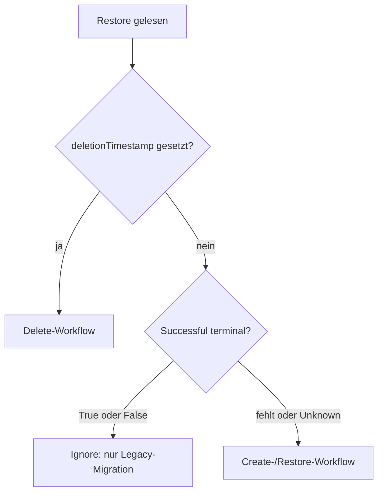
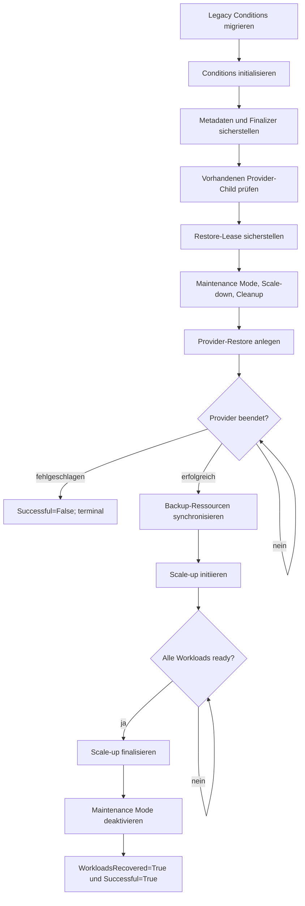
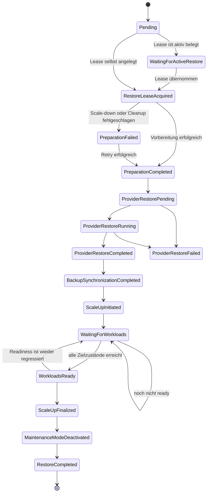
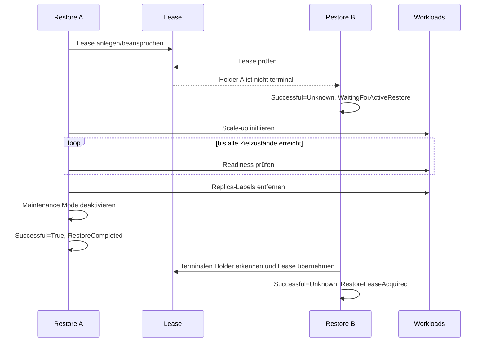
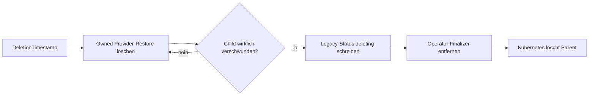

# Restore-Prozess

Diese Dokumentation beschreibt den Restore-Workflow des `k8s-backup-operator` aus Entwicklersicht. Maßgeblich ist der aktuell implementierte, zustandsbasierte Ablauf im Paket `internal/controller/restore`. Ein Reconcile führt nicht den gesamten Restore synchron aus. Stattdessen konvergiert er genau bis zur nächsten Stage, die eine Mutation schreibt, warten muss oder einen Fehler meldet.

Das zentrale Sicherheitsziel lautet:

> Ein Restore ist erst erfolgreich abgeschlossen, wenn der Provider-Restore erfolgreich war, die Workloads ihre Soll-Replikazahl tatsächlich erreicht haben, die temporären Recovery-Labels entfernt wurden und der Maintenance Mode deaktiviert wurde.

Insbesondere reicht das bloße Setzen von `spec.replicas` nicht aus. Solange `Successful=True` noch nicht geschrieben wurde, bleibt das namespaceweite Restore-Lease für andere Restores gesperrt.

## Begriffe und beteiligte Ressourcen

- **Restore**: die Custom Resource `k8s.cloudogu.com/.../Restore`, die den Workflow steuert.
- **Provider-Restore**: die vom Provider ausgeführte Child-Ressource; derzeit ein Velero-`Restore` mit demselben Namen und Namespace.
- **Stage**: eine idempotente `ensure...`-Methode des Reconcilers.
- **Condition**: beobachtbarer Teilstatus in `Restore.status.conditions`.
- **Reason**: feinere Zustandsangabe innerhalb einer Condition.
- **Restore-Lease**: das Kubernetes-`Lease` `k8s-backup-operator-restore`, das Restores innerhalb eines Namespace serialisiert.
- **Scope-Label**: `k8s.cloudogu.com/restore-scaledown-scope`; dauerhaftes Opt-in eines Workloads für Scale-down und Readiness-Prüfung.
- **Replica-Label**: `k8s.cloudogu.com/restore-scaledown-replicas`; temporäre Speicherung der ursprünglichen Replikazahl.

Unterstützte skalierbare Workloads sind `Deployment`, `StatefulSet`, nicht von anderen Objekten kontrollierte `ReplicaSet` sowie `ReplicationController`.

## Grundmodell des Reconcilers

Der Reconciler unterscheidet drei Operationen:



`Successful=True` und `Successful=False` sind terminal. `Successful=Unknown` ist ausdrücklich nicht terminal und bedeutet, dass der Workflow weiterarbeiten oder warten muss. Das veraltete skalare Feld `status.status` wird weiterhin für ältere Clients gespiegelt, die Steuerung erfolgt jedoch über Conditions.

### Stage-Ergebnisse

Eine Stage liefert genau eines der folgenden Ergebnisse:

| Ergebnis | Bedeutung |
|---|---|
| `next()` | Die Stage ist bereits konvergiert; die nächste Stage darf im selben Reconcile laufen. |
| `retryAfter(d)` | Der Reconcile endet kontrolliert und wird nach `d` erneut ausgeführt. Der Standardwert ist 5 Sekunden. |
| `retryOnError(err)` | Der Reconcile endet mit Fehler; `controller-runtime` übernimmt exponentielles Backoff. |
| `abort()` | Der Reconcile endet ohne explizites Requeue, beispielsweise bei einem terminalen Ergebnis. |

Eine schreibende Stage beendet normalerweise den aktuellen Reconcile. Dadurch laufen nicht mehrere externe Mutationen auf Basis eines möglicherweise veralteten Restore-Objekts. Watch-Events sind der primäre Trigger; die Zeitangaben dienen zusätzlich als Fallback für verlorene Events. Während der Provider arbeitet, beträgt dieser Fallback fünf Minuten.

## Gesamtablauf eines erfolgreichen Restores

Die Create-Stages werden in folgender Reihenfolge ausgeführt:



In Methodennamen lautet die Folge:

1. `ensureLegacyConditionsMigrated`
2. `ensureConditionsInitialized`
3. `ensureMetadata`
4. `ensureProviderChildState`
5. `ensureActiveRestoreLease`
6. `ensurePreparation`
7. `ensureProviderRestore`
8. `ensureProviderCompletion`
9. `ensureBackupsSynchronized`
10. `ensureScaleUpInitiated`
11. `ensureWorkloadsReady`
12. `ensureScaleUpFinalized`
13. `ensureMaintenanceModeDeactivated`
14. `ensureRestoreCompleted`

## Conditions und Übergänge

Jeder neue, laufende Restore erhält zunächst diese fünf Conditions mit `Status=Unknown`, `Reason=Pending`:

- `Successful`
- `Prepared`
- `ProviderRestoreSuccessful`
- `WorkloadsRecovered`
- `BackupsSynchronized`

Eine vorhandene Condition wird bei der Initialisierung nicht auf `Unknown` zurückgesetzt. Das ist wichtig, wenn ein Status-Write erfolgreich war, der Prozess aber unmittelbar danach abstürzt.

### Übersicht als Zustandsdiagramm



Das Diagramm fasst Reasons verschiedener Conditions zusammen. Die folgenden Abschnitte ordnen sie exakt zu.

### `Successful`

`Successful` ist die übergeordnete und lease-relevante Abschluss-Condition.

| Status | Reason | Bedeutung |
|---|---|---|
| `Unknown` | `Pending` | Workflow wurde erkannt, hat aber den nächsten Meilenstein noch nicht erreicht. |
| `Unknown` | `WaitingForActiveRestore` | Ein anderer nicht-terminaler Restore hält das Lease. Destruktive Stages werden nicht gestartet. |
| `Unknown` | `RestoreLeaseAcquired` | Der wartende Restore besitzt das Lease nun selbst und darf fortfahren. |
| `Unknown` | `InvalidRestoreLease` | Das Lease enthält weder eine sicher zuordenbare UID noch einen Namen. Manuelles Prüfen und gegebenenfalls Löschen ist erforderlich. |
| `True` | `RestoreCompleted` | Der vollständige Workflow einschließlich Readiness, Label-Cleanup und Maintenance-Deaktivierung ist abgeschlossen. |
| `False` | `ProviderRestoreFailed` | Der Provider-Restore ist terminal fehlgeschlagen. |
| `False` | `ProviderRestoreConflict` | Eine gleichnamige Provider-Ressource kann nicht sicher diesem Restore zugeordnet werden. |
| `True/False/Unknown` | `MigratedFromLegacyStatus` | Aus dem alten skalaren Status eines mit einer älteren Operator-Version angelegten Restore abgeleitet. |

`Successful=True` wird ausschließlich in `ensureRestoreCompleted` zusammen mit `WorkloadsRecovered=True` geschrieben. Dies ist die entscheidende Änderung gegenüber einem Ablauf, der bereits nach dem Anstoßen des Scale-up als abgeschlossen galt.

### `Prepared`

| Status | Reason | Bedeutung |
|---|---|---|
| `Unknown` | `Pending` | Vorbereitung noch nicht abgeschlossen. |
| `False` | `PreparationFailed` | Scale-down oder Cleanup schlug fehl; der Vorgang wird mit Backoff wiederholt. |
| `True` | `PreparationCompleted` | Maintenance Mode wurde best-effort aktiviert, Workloads wurden herunterskaliert und Restore-Ressourcen bereinigt. |

Die Aktivierung des Maintenance Mode ist bewusst best-effort. Ein Fehler wird protokolliert, verhindert den Restore aber nicht. Scale-down und Cleanup dagegen müssen erfolgreich sein.

Vor der destruktiven Vorbereitung wird geprüft, ob der Provider verfügbar ist. Existiert bereits ein eindeutig zugehöriger Provider-Child, gilt die Vorbereitung ebenfalls als bereits erfolgt. So wird das kritische Crash-Fenster zwischen Child-Erstellung und Parent-Status-Write nicht mit einem zweiten Cleanup beantwortet.

### `ProviderRestoreSuccessful`

| Status | Reason | Bedeutung |
|---|---|---|
| `Unknown` | `Pending` | Provider-Stage noch nicht erreicht. |
| `Unknown` | `ProviderRestorePending` | Provider-Child existiert, hat aber noch nicht begonnen. |
| `Unknown` | `ProviderRestoreRunning` | Provider arbeitet. |
| `Unknown` | `ProviderRestoreStateUnknown` | Der Provider meldet eine dem Operator unbekannte Phase. Sie wird niemals als Erfolg interpretiert. |
| `True` | `ProviderRestoreCompleted` | Provider hat den Backup-Inhalt erfolgreich wiederhergestellt. |
| `False` | `ProviderRestoreFailed` | Provider meldet einen terminalen Fehler, einschließlich Validation- und Partial-Failures. |
| `False` | `ProviderRestoreConflict` | Gleichnamiger Child ist nicht sicher adoptierbar. |

Bei Pending, Running oder unbekanntem Zustand wartet der Controller auf Child-Events; ein Fallback-Requeue erfolgt nach fünf Minuten. Nur `True/ProviderRestoreCompleted` lässt den Workflow zur Backup-Synchronisierung und Workload-Recovery weiterlaufen.

Bei einem Provider-Fehler werden außerdem gesetzt:

- `WorkloadsRecovered=False/RecoveryNotAttemptedAfterProviderFailure`
- `BackupsSynchronized=False/SynchronizationNotAttemptedAfterProviderFailure`
- `Successful=False/ProviderRestoreFailed`

Die Workloads bleiben in diesem Fehlerpfad absichtlich herunterskaliert. Der Maintenance Mode wird best-effort deaktiviert. Weil `Successful=False` terminal ist, kann das Lease anschließend von einem anderen Restore übernommen werden. Entwickler müssen dieses bewusst andere Sicherheitsmodell des Fehlerpfads bei Änderungen berücksichtigen.

### `BackupsSynchronized`

| Status | Reason | Bedeutung |
|---|---|---|
| `Unknown` | `Pending` | Synchronisierung noch nicht versucht. |
| `False` | `BackupSynchronizationFailed` | Provider-Katalog und Backup-CRs konnten nicht synchronisiert werden; Retry mit Backoff. |
| `True` | `BackupSynchronizationCompleted` | Backup-Ressourcen entsprechen wieder dem Provider-Katalog. |
| `False` | `SynchronizationNotAttemptedAfterProviderFailure` | Wegen terminalem Provider-Fehler bewusst übersprungen. |

### `WorkloadsRecovered`

Diese Condition bildet mehrere nicht-terminale Recovery-Schritte ab. Bis zum letzten Schritt bleibt ihr Status `Unknown`.

| Status | Reason | Schreibende Stage | Bedeutung |
|---|---|---|---|
| `Unknown` | `Pending` | Initialisierung | Recovery noch nicht begonnen. |
| `Unknown` | `ScaleUpInitiated` | `ensureScaleUpInitiated` | Ursprüngliche Soll-Replikazahlen wurden in `spec.replicas` zurückgeschrieben. Pods müssen noch nicht existieren oder ready sein. |
| `Unknown` | `WaitingForWorkloads` | `ensureWorkloadsReady` | Mindestens ein Workload hat seinen Zielzustand noch nicht erreicht. Requeue nach fünf Sekunden. |
| `Unknown` | `WorkloadsReady` | `ensureWorkloadsReady` | Alle beobachteten Workloads erfüllen sämtliche Readiness-Kriterien. |
| `Unknown` | `ScaleUpFinalized` | `ensureScaleUpFinalized` | Temporäre Replica-Labels wurden entfernt. |
| `Unknown` | `MaintenanceModeDeactivated` | `ensureMaintenanceModeDeactivated` | Maintenance Mode wurde erfolgreich deaktiviert. |
| `True` | `WorkloadRecoveryCompleted` | `ensureRestoreCompleted` | Recovery ist vollständig abgeschlossen. |
| `False` | `WorkloadRecoveryFailed` | Scale-up/Finalisierung | Ein Recovery-Schritt schlug fehl und wird erneut versucht. |
| `False` | `RecoveryNotAttemptedAfterProviderFailure` | Provider-Fehlerpfad | Recovery wurde absichtlich nicht gestartet. |

`ReasonRecoveringWorkloads` ist derzeit noch als Konstante vorhanden, wird vom neuen mehrstufigen Recovery-Ablauf aber nicht geschrieben. Dasselbe gilt für `ReasonPreparing`; die tatsächliche Preparation-Condition wechselt direkt von `Pending` beziehungsweise `PreparationFailed` zu `PreparationCompleted`.

## Workload-Recovery im Detail

### 1. Scale-up initiieren

Beim Scale-down wird die aktuelle Replikazahl beispielsweise so gespeichert:

```yaml
apiVersion: apps/v1
kind: Deployment
metadata:
  labels:
    k8s.cloudogu.com/restore-scaledown-scope: component-a
    k8s.cloudogu.com/restore-scaledown-replicas: "3"
spec:
  replicas: 0
```

`ScaleUp` liest das temporäre Replica-Label und setzt `spec.replicas` wieder auf `3`. Das Label bleibt zunächst erhalten. Die Operation ist idempotent: Ist `spec.replicas` bereits korrekt, wird kein unnötiges Update geschrieben.

Die für alle unterstützten Workload-Typen identische Scale-down-Logik (vorhandenes Label erkennen, Replikazahl speichern, auf null setzen und aktualisieren) wird zentral ausgeführt. Auch das optionale Lesen und Validieren des Replica-Labels beim Scale-up verwendet einen gemeinsamen Helfer. Lediglich das Auflisten der konkreten Kubernetes-Typen und deren typspezifische Readiness-Kriterien bleiben getrennt.

`ensureScaleUpInitiated` ruft `ScaleUp` absichtlich **vor** der Condition-Prüfung auf. Beispiel für ein Crash-Fenster:

1. Deployment A wurde bereits auf drei Replikas gesetzt.
2. Der Controller stürzt vor dem Status-Write ab.
3. Im nächsten Reconcile wird `ScaleUp` erneut ausgeführt.
4. Deployment A ist bereits korrekt; weitere oder teilweise bearbeitete Workloads werden konvergiert.
5. Erst danach wird `WorkloadsRecovered=Unknown/ScaleUpInitiated` persistiert.

### 2. Workloads beobachten

`ensureWorkloadsReady` blockiert keinen Controller-Worker. Es liest alle Workloads im Namespace mit dem dauerhaften Scope-Label und beendet den Reconcile mit einem zeitgesteuerten Retry, solange noch nicht alles bereit ist.

Die Ziel-Replikazahl kommt primär aus `restore-scaledown-replicas`. Nach dessen Entfernung wird `spec.replicas` verwendet. Dadurch bleibt ein Workload auch bei teilweise abgeschlossenem Label-Cleanup auffindbar und prüfbar.

Die Kriterien sind absichtlich strenger als nur `ReadyReplicas > 0`:

| Typ | Erforderlicher Zustand |
|---|---|
| `Deployment` | `spec.replicas == target`, `observedGeneration >= generation`, `replicas`, `updatedReplicas`, `readyReplicas` und `availableReplicas` jeweils `target`, zusätzlich `unavailableReplicas == 0` |
| `StatefulSet` | `spec.replicas == target`, `observedGeneration >= generation`, `replicas`, `readyReplicas` und `availableReplicas` jeweils `target` |
| freies `ReplicaSet` | wie StatefulSet: beobachtete Generation sowie replicas/ready/available gleich Ziel |
| `ReplicationController` | wie StatefulSet: beobachtete Generation sowie replicas/ready/available gleich Ziel |

Auch nach einem persistierten `WorkloadsReady` wird die Readiness beim nächsten Durchlauf erneut geprüft. Regressiert ein Workload, wechselt der Reason zurück auf `WaitingForWorkloads`; die Finalisierung darf dann noch nicht beginnen.

Ein Zielwert `0` ist gültig: Ein zuvor bewusst auf null skalierter Workload ist bereit, wenn seine beobachteten Statuswerte ebenfalls null sind. Ein ungültiger Wert im Replica-Label oder ein fehlender Zielwert ist ein Beobachtungsfehler und führt zu einem Retry mit Backoff.

### 3. Scale-up finalisieren

Erst nach bestätigter Readiness entfernt `FinalizeScaleUp` das temporäre Label `k8s.cloudogu.com/restore-scaledown-replicas`. Das dauerhafte Scope-Label bleibt erhalten. Es ist die Konfiguration, die den Workload auch für zukünftige Restores auswählt und ihn nach der Label-Bereinigung weiterhin beobachtbar macht.

Die Finalisierung ist ebenfalls idempotent. Bei einem Teilfehler können bereits bereinigte Objekte im nächsten Reconcile übersprungen und die verbliebenen Labels entfernt werden. `ensureScaleUpFinalized` führt deshalb die externe Aktion vor seiner Condition-Prüfung aus.

### 4. Maintenance Mode deaktivieren

Der Maintenance Mode wird erst deaktiviert, nachdem alle Workloads ready und alle temporären Replica-Labels bereinigt sind. Anders als bei der Aktivierung ist ein Fehler hier nicht best-effort: `ensureMaintenanceModeDeactivated` liefert einen Fehler und versucht die Deaktivierung erneut. Die Aktion findet wiederum vor der Condition-Prüfung statt, um einen Absturz vor dem Status-Write sicher abzufangen.

### 5. Restore abschließen

`ensureRestoreCompleted` führt selbst keine externe Recovery-Aktion mehr aus. Die Stage akzeptiert ausschließlich den Vorgängerzustand:

```text
WorkloadsRecovered = Unknown / MaintenanceModeDeactivated
```

Dann werden in einem gemeinsamen Status-Write gesetzt:

```yaml
status:
  conditions:
    - type: WorkloadsRecovered
      status: "True"
      reason: WorkloadRecoveryCompleted
    - type: Successful
      status: "True"
      reason: RestoreCompleted
  status: completed # veraltetes Kompatibilitätsfeld
```

Dadurch gibt es keinen beobachtbaren Zustand, in dem `Successful=True` bereits gesetzt, `WorkloadsRecovered` aber noch unvollständig ist.

## Lease und konkurrierende Restores

Das Lease ist namespaceweit und hat einen festen Namen. `spec.holderIdentity` enthält die unveränderliche UID des Restore; die Annotation `k8s.cloudogu.com/restore-lease-holder-name` enthält zusätzlich dessen Namen.



Ein Zeitablauf allein macht ein Lease nie stale. Ein Provider-Restore kann legitim sehr lange dauern. Übernommen wird das Lease nur, wenn der exakte Holder nicht mehr existiert, seine UID nicht mehr zum benannten Objekt passt oder der Holder terminal (`Successful=True` oder `Successful=False`) ist. Updates verwenden die Kubernetes-`resourceVersion` als Compare-and-swap; bei Konflikten wird neu gelesen.

Teilweise fehlende Holder-Informationen werden repariert, wenn UID oder Name den aktiven Restore eindeutig identifizieren. Fehlen beide Angaben, bleibt der Workflow mit `InvalidRestoreLease` gesperrt, weil eine automatische Übernahme nicht sicher wäre.

## Fehler- und Wiederanlaufverhalten

Der Workflow ist level-triggered: Conditions dokumentieren den Fortschritt, externe Ressourcen bleiben jedoch die Wahrheit für bereits ausgeführte Aktionen.

Typische Beispiele:

- **Status-Konflikt:** Condition-Write schlägt fehl; die Stage wird mit Backoff wiederholt.
- **Crash nach Workload-Update:** `ScaleUp` oder `FinalizeScaleUp` wird idempotent erneut ausgeführt.
- **Verlorenes Watch-Event:** kontrollierte Fallback-Requeues stoßen die Beobachtung erneut an.
- **Teilweise Label-Bereinigung:** Das permanente Scope-Label hält alle Objekte auffindbar; nur noch vorhandene Replica-Labels werden entfernt.
- **Readiness-Regression:** `WorkloadsReady` ist kein Freibrief; die nächste Ausführung prüft erneut und kann zurück auf `WaitingForWorkloads` wechseln.
- **Unbekannte Provider-Phase:** bleibt `Unknown`, niemals impliziter Erfolg.
- **Fremder Provider-Child:** terminaler `ProviderRestoreConflict`, bevor destruktive Vorbereitung beginnt.

## Delete-Workflow

Das Löschen eines Restore folgt einer eigenen Stage-Reihenfolge:



Die Delete-Anforderung an den Provider-Child wird nicht mit dessen tatsächlicher Entfernung verwechselt. Der Parent behält seinen Operator-Finalizer, bis ein späteres `Get` bestätigt, dass der Child nicht mehr existiert. Fremde gleichnamige Children werden nicht gelöscht und blockieren die Parent-Löschung nicht. Andere, dem Operator nicht gehörende Finalizer bleiben unangetastet.

## Acceptance-Tests

Die Cluster-Acceptance-Tests liegen in `acceptance-tests/restore_test.go`. Sie sind mit dem Build-Tag `acceptance` von normalen Unit-Test-Läufen ausgeschlossen und verwenden Ginkgo/Gomega.

### Sicherheitsvoraussetzungen

Die Restore-Specs sind destruktiv und dürfen nur gegen einen entbehrlichen Testcluster laufen. Im Namespace `ecosystem` werden alle Dogus sowie alle vom Restore-Scope erfassten ConfigMaps, Secrets und PVCs bereinigt. Die Suite ist deshalb `Serial` und `Ordered`.

`K8S_TEST_CLUSTER_KUBECONFIG` muss auf **genau eine** Kubeconfig-Datei zeigen. Eine KUBECONFIG-Liste wird absichtlich abgelehnt, damit nicht durch Präzedenzregeln versehentlich der falsche Cluster getroffen wird. Der tatsächlich verwendete API-Server wird vor dem Lauf ausgegeben.

Vor dem Test wird außerdem geprüft, ob ein Deployment noch ein temporäres `restore-scaledown-replicas`-Label aus einem abgebrochenen Restore trägt. Solche Altlasten würden eine veraltete Zielzahl zurückspielen und deshalb zu irreführenden Ergebnissen führen.

### Abgedeckte Szenarien

#### Erfolgreiches Erstellen

Die Spec erzeugt ein Wegwerf-Deployment mit zwei Replikas und Scope-Label sowie eine zusätzliche, nach dem Backup erzeugte ConfigMap mit Backup-Scope-Label. Anschließend prüft sie:

1. Der Provider-Restore wird angelegt.
2. Der Parent erreicht den Legacy-Kompatibilitätsstatus `completed`.
3. Die nicht im Backup enthaltene ConfigMap bleibt nach dem Cleanup gelöscht.
4. Das Deployment wird auf exakt zwei Replikas zurückskaliert.
5. Das temporäre Replica-Label wurde entfernt.
6. Alle PVCs sind `Bound` und alle Deployments haben ihre gewünschte Anzahl `ReadyReplicas`.
7. Ein erzwungener Reconcile eines bereits abgeschlossenen Restore verändert weder Status noch Replikazahl.

Die PVC- und Workload-Konvergenz wird bis zu 15 Minuten gepollt. Ein terminal fehlgeschlagener Backup- oder Restore-Status bricht das Warten frühzeitig ab und hängt den beobachteten Status an den Ginkgo-Fehler an.

#### Löschen

Testeigene Hold-Finalizer machen die sonst kurzen Zwischenzustände beobachtbar. Geprüft wird:

1. Der Provider-Child beginnt zu terminieren, während der Parent durch den Operator-Finalizer geschützt bleibt.
2. Nach Freigabe des Child-Holds verschwindet der Provider-Restore wirklich.
3. Der Parent persistiert `deleting`, entfernt nur den Operator-Finalizer und behält fremde Finalizer.
4. Nach Freigabe des Parent-Holds wird auch der Parent gelöscht.

#### Zwei konkurrierende Restores

Die Spec erstellt zwei Restore-Ressourcen gleichzeitig und ermittelt dynamisch Gewinner und Wartenden. Sie prüft:

1. Genau der Lease-Holder darf einen Provider-Restore starten.
2. Der Wartende zeigt `Successful=Unknown/WaitingForActiveRestore` und besitzt noch keinen Provider-Child.
3. Erst nachdem der erste Restore vollständig `completed` ist, steigt `leaseTransitions` und das Lease wechselt zum Wartenden.
4. Danach startet und beendet auch der zweite Restore seinen Provider-Restore.

Damit deckt der Acceptance-Test genau die kritische Invariante ab: Die Lease-Übergabe geschieht erst nach dem vollständigen Recovery-Abschluss, nicht unmittelbar nach dem Setzen von `spec.replicas`.

## Test-Targets und Filter

### Alle Acceptance-Specs

```bash
K8S_TEST_CLUSTER_KUBECONFIG=/absoluter/pfad/kubeconfig \
  make acceptance-test
```

Das Target ruft Ginkgo rekursiv und parallel mit dem Build-Tag `acceptance` auf:

```text
go run github.com/onsi/ginkgo/v2/ginkgo -p -r --tags=acceptance ./acceptance-tests/...
```

### Nur Restore-Acceptance-Tests

Das bevorzugte Target ist:

```bash
K8S_TEST_CLUSTER_KUBECONFIG=/absoluter/pfad/kubeconfig \
  make acceptance-test-restore
```

Es delegiert an `acceptance-test` und setzt `GINKGO_LABEL_FILTER=restore`. Gleichwertig ist:

```bash
K8S_TEST_CLUSTER_KUBECONFIG=/absoluter/pfad/kubeconfig \
  make acceptance-test GINKGO_LABEL_FILTER=restore
```

Beliebige Ginkgo-Label-Ausdrücke sind möglich, beispielsweise:

```bash
make acceptance-test GINKGO_LABEL_FILTER='restore && !slow'
```

Aktuell besitzt die Restore-Suite das Label `restore`; weitere Labels müssten zuerst an den Specs ergänzt werden.

### Nach Spec-Text filtern

Mit `GINKGO_FOCUS` lässt sich ein Teilbaum oder eine einzelne Spec über einen regulären Ausdruck auswählen:

```bash
K8S_TEST_CLUSTER_KUBECONFIG=/absoluter/pfad/kubeconfig \
  make acceptance-test-restore GINKGO_FOCUS='Creating a Restore'
```

Weitere Beispiele:

```bash
make acceptance-test-restore GINKGO_FOCUS='Deleting a restore'
make acceptance-test-restore GINKGO_FOCUS='Serializing concurrent Restores with a Lease'
make acceptance-test-restore GINKGO_FOCUS='scaled-down workload is back'
```

Label- und Fokusfilter können kombiniert werden. Shell-Quoting ist wichtig, weil Leerzeichen und reguläre Ausdrücke sonst von der Shell beziehungsweise von `make` zerlegt werden.

### Unit-Tests des Restore-Controllers

Alle Unit-Tests des Pakets lassen sich direkt und ohne Cluster ausführen:

```bash
go test ./internal/controller/restore
```

Einzelne Testfunktionen können mit dem Go-Filter ausgeführt werden:

```bash
go test ./internal/controller/restore -run 'TestWorkloadReadiness'
go test ./internal/controller/restore -run 'TestAreWorkloadsReady'
```

Das allgemeine Make-Target lautet:

```bash
make unit-test
```

Es iteriert über `PACKAGES`, erzeugt Coverage- und JUnit-Berichte unter `target/unit-tests`, bietet derzeit aber keinen eigenen `-run`-Parameter. Für schnelles fokussiertes Entwickeln ist deshalb der direkte `go test ... -run ...`-Aufruf klarer. Ein Paketfilter kann bei Bedarf über die Make-Variable gesetzt werden:

```bash
make unit-test PACKAGES=./internal/controller/restore
```

### Kubernetes-Integrationstests

Die Envtest-basierte Suite ist von den echten Cluster-Acceptance-Tests getrennt:

```bash
make k8s-integration-test
```

Dieses Target verwendet den Build-Tag `k8s_integration` und Kubebuilder-Assets. Es validiert Controller-Verhalten gegen einen lokalen API-Server, ersetzt aber nicht die destruktiven Ende-zu-Ende-Prüfungen mit echtem Provider, Storage, Dogus und Maintenance Mode.

## Hinweise für Erweiterungen

- Jede neue `ensure...`-Methode des Restore-Reconcilers erhält eine eigene Datei `reconcile_ensure<Name>.go` und eine zugehörige Datei `reconcile_ensure<Name>_test.go`.
- Eine Condition darf keinen externen Zustand behaupten, der nur angestoßen, aber noch nicht beobachtet wurde.
- Externe Aktionen müssen wiederholbar sein oder vor einer Wiederholung den tatsächlichen Clusterzustand prüfen.
- Temporäre Marker dürfen erst entfernt werden, wenn sie für keine folgende Verifikation mehr benötigt werden.
- Das dauerhafte Scope-Label darf bei der Recovery-Finalisierung nicht entfernt werden.
- `Successful` darf nur terminal werden, wenn alle sicherheitsrelevanten Nachbedingungen erfüllt sind oder ein ausdrücklich terminaler Fehlerpfad gewählt wurde.
- Neue Provider-Phasen müssen explizit gemappt werden; unbekannte Phasen bleiben `Unknown`.
- Änderungen an Lease-, Readiness- oder Finalizer-Semantik sollten sowohl fokussierte Unit-Tests als auch das passende Acceptance-Szenario erhalten.
