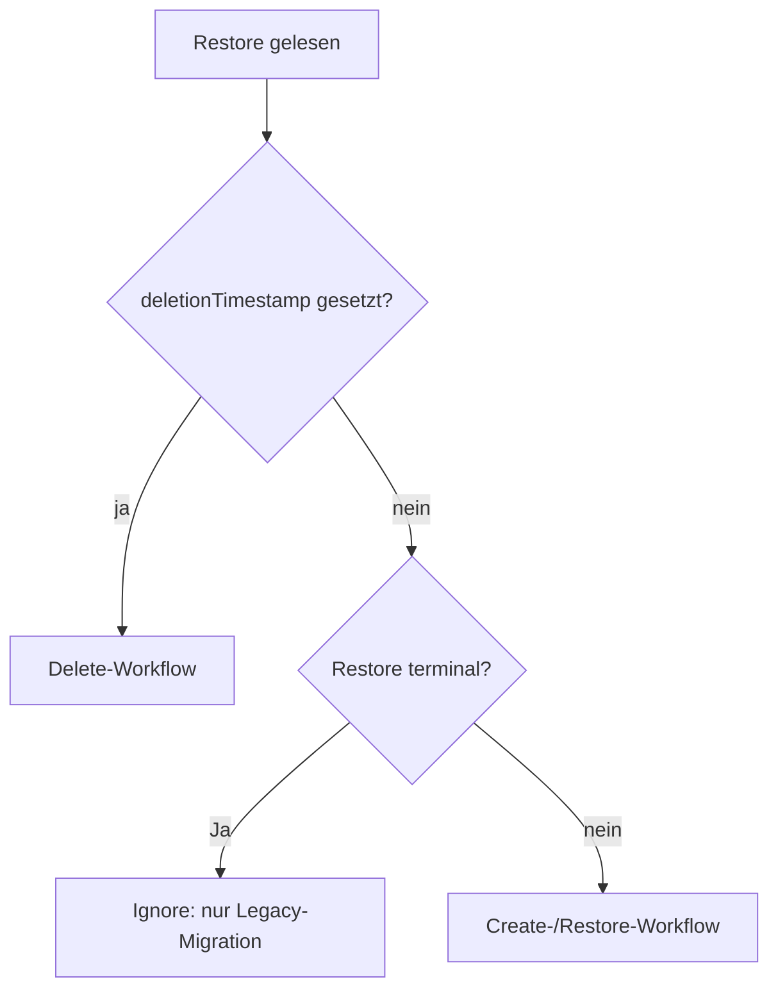
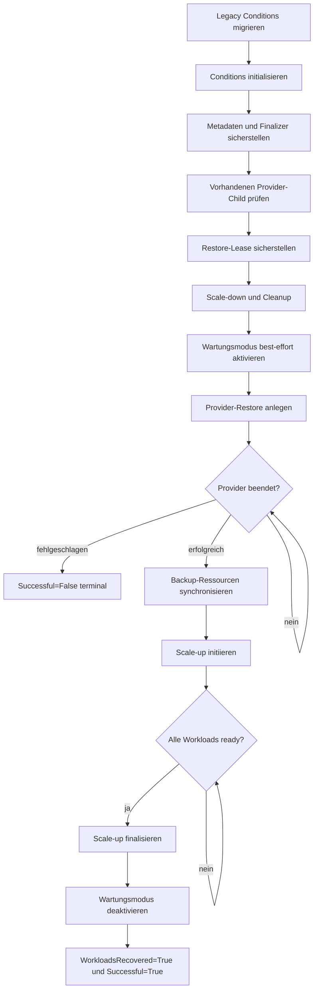
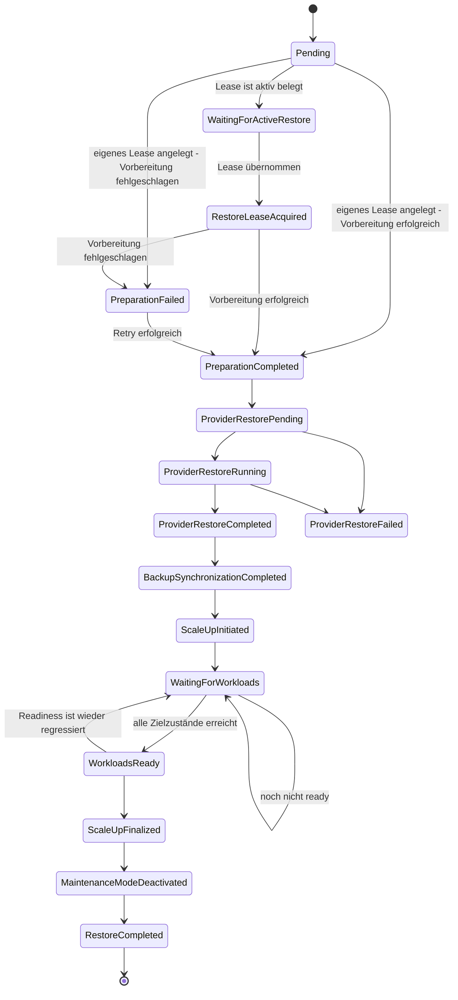
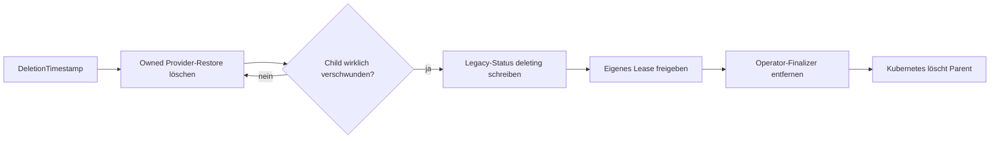

# Restore-Prozess

Diese Dokumentation beschreibt den Restore-Workflow des `k8s-backup-operator`. 
Ein Reconcile führt nicht den gesamten Restore synchron / blockierend aus. 
Stattdessen wird die CR bis zur nächsten Stage bearbeitet, die die Ressource verändert, der Operator warten muss oder ein Fehler gemeldet wird.

## Grundmodell des Reconcilers

Der Reconciler unterscheidet drei Operationen:



`Successful=True` und `Successful=False` sind terminal. `Successful=Unknown` ist ausdrücklich nicht terminal und bedeutet, dass der Workflow weiterarbeiten oder warten muss. Das veraltete skalare Feld `status.status` wird weiterhin für ältere Clients gespiegelt, die Steuerung erfolgt jedoch über Conditions.

Der Controller beobachtet sowohl Parent-`Restore`-Ressourcen als auch owned Velero-`Restore`-Children. Es gibt bewusst weder einen controllerweiten Event-Filter noch eine `GenerationChangedPredicate`: Provider-Phasenwechsel sowie Status-, Finalizer- und Löschereignisse des Parents müssen einen Reconcile auslösen können.

### Stage-Ergebnisse

Eine Stage liefert genau eines der folgenden Ergebnisse:

| Ergebnis | Bedeutung |
|---|---|
| `next()` | Die Stage ist bereits konvergiert; die nächste Stage darf im selben Reconcile laufen. |
| `retryAfter(d)` | Der Reconcile endet kontrolliert und wird nach der von der Stage angegebenen Dauer `d` erneut ausgeführt. Ist `d` nicht positiv, verwendet `runStages` das über `requeueTimeSeconds` konfigurierte Requeue-Intervall. Einige Stages geben ausdrücklich den internen Festwert von 5 Sekunden an. |
| `retryOnError(err)` | Der Reconcile endet mit Fehler; `controller-runtime` übernimmt exponentielles Backoff. |
| `abort()` | Der Reconcile endet ohne explizites Requeue, beispielsweise bei einem terminalen Ergebnis. |

Eine schreibende Stage beendet normalerweise den aktuellen Reconcile. Dadurch laufen nicht mehrere externe Mutationen auf Basis eines möglicherweise veralteten Restore-Objekts. Watch-Events sind der primäre Trigger; die Zeitangaben dienen zusätzlich als Fallback für verlorene Events. Für normale kontrollierte Retries verwenden viele Stages das über `requeueTimeSeconds` konfigurierte Intervall, einige Stages dagegen ausdrücklich den festen internen Wert von 5 Sekunden. Während der Provider arbeitet, ist der Fallback fest auf fünf Minuten gesetzt. Bei `retryOnError(err)` gilt keine dieser Zeiten; hier bestimmt das exponentielle Backoff von `controller-runtime` den nächsten Versuch.

## Gesamtablauf eines erfolgreichen Restores

Die Create-Stages werden in folgender Reihenfolge ausgeführt:



In Methodennamen lautet die Folge:

1. `ensureLegacyConditionsMigrated`
2. `ensureConditionsInitialized`
3. `ensureMetadata`
4. `ensureProviderChildState`
5. `ensureActiveRestoreLease`
6. `ensurePreparation`
7. `ensureMaintenanceModeActivated`
8. `ensureProviderRestore`
9. `ensureProviderCompletion`
10. `ensureBackupsSynchronized`
11. `ensureScaleUpInitiated`
12. `ensureWorkloadsReady`
13. `ensureScaleUpFinalized`
14. `ensureMaintenanceModeDeactivated`
15. `ensureRestoreCompleted`

## Conditions und Übergänge

Jeder neue, laufende Restore erhält zunächst diese fünf Conditions mit `Status=Unknown`, `Reason=Pending`:

- `Successful`
- `Prepared`
- `ProviderRestoreSuccessful`
- `WorkloadsRecovered`
- `BackupsSynchronized`

Eine vorhandene Condition wird bei der Initialisierung nicht auf `Unknown` zurückgesetzt. Das ist wichtig, wenn ein Status-Write erfolgreich war, der Prozess aber unmittelbar danach abstürzt.

### Übersicht als Zustandsdiagramm



Das Diagramm fasst Reasons verschiedener Conditions zusammen. Die folgenden Abschnitte ordnen sie exakt zu.

### `Successful`

`Successful` ist die übergeordnete und lease-relevante Abschluss-Condition.

| Status | Reason | Bedeutung                                                                                                                           |
|---|---|-------------------------------------------------------------------------------------------------------------------------------------|
| `Unknown` | `Pending` | Workflow wurde erkannt, hat aber den nächsten Meilenstein noch nicht erreicht.                                                      |
| `Unknown` | `WaitingForActiveRestore` | Ein anderer nicht-terminaler Restore oder Backup hält das Lease. Destruktive Stages werden nicht gestartet.                         |
| `Unknown` | `RestoreLeaseAcquired` | Der wartende Restore besitzt das Lease nun selbst und darf fortfahren.                                                              |
| `Unknown` | `InvalidRestoreLease` | Das Lease enthält weder eine sicher zuordenbare UID noch einen Namen. Manuelles Prüfen und gegebenenfalls Löschen ist erforderlich. |
| `True` | `RestoreCompleted` | Der vollständige Workflow einschließlich Readiness, Label-Cleanup und Maintenance-Deaktivierung ist abgeschlossen.                  |
| `False` | `ProviderRestoreFailed` | Der Provider-Restore ist terminal fehlgeschlagen.                                                                                   |
| `False` | `ProviderRestoreConflict` | Eine gleichnamige Provider-Ressource kann nicht sicher diesem Restore zugeordnet werden.                                            |
| `True/False/Unknown` | `MigratedFromLegacyStatus` | Aus dem alten skalaren Status eines mit einer älteren Operator-Version angelegten Restore abgeleitet.                               |

`Successful=True` wird ausschließlich in `ensureRestoreCompleted` zusammen mit `WorkloadsRecovered=True` geschrieben.

### Legacy-Kompatibilitätsstatus

Jeder Status-Write synchronisiert zusätzlich das veraltete Feld `status.status`. Die Abbildung lautet:

| Zustand | `status.status` |
|---|---|
| `metadata.deletionTimestamp` gesetzt | `deleting` |
| keine `Successful`-Condition, Workflow bereits beobachtet | `inProgress` |
| `Successful=Unknown` | `inProgress` |
| `Successful=True` | `completed` |
| `Successful=False` | `failed` |

Bei älteren Restores ohne `Successful`-Condition wird umgekehrt ein vorhandenes `completed`, `failed` oder `inProgress` einmalig als `Successful=True`, `False` beziehungsweise `Unknown` mit `Reason=MigratedFromLegacyStatus` persistiert. Eine bereits vorhandene Condition hat immer Vorrang vor dem Legacy-Feld. Ein unbekannter, neuer oder löschender Legacy-Status wird nicht als Ergebnis interpretiert.

### Metadaten vor dem Workflow

Vor Lease und destruktiver Vorbereitung stellt `ensureMetadata` den Operator-Finalizer sowie die CES-Labels `app=ces` und `k8s.cloudogu.com/part-of=backup` sicher. Beide Änderungen werden in einem gemeinsamen, no-op-fähigen Parent-Update geschrieben. Ein tatsächlicher Write beendet den aktuellen Reconcile, damit die folgenden Mutationen mit der persistierten Ressource arbeiten.

### `Prepared`

| Status | Reason | Bedeutung |
|---|---|---|
| `Unknown` | `Pending` | Vorbereitung noch nicht abgeschlossen. |
| `False` | `PreparationFailed` | Scale-down oder Cleanup schlug fehl; der Vorgang wird mit Backoff wiederholt. |
| `True` | `PreparationCompleted` | Workloads wurden herunterskaliert und Restore-Ressourcen bereinigt. |

Nach der Preparation aktiviert die eigene Stage `ensureMaintenanceModeActivated` den Wartungsmodus best-effort. Sie prüft zuerst den tatsächlichen Zustand und aktiviert ihn nur, wenn er noch inaktiv ist. Ein Fehler wird protokolliert und als Event gemeldet, verhindert den Restore aber nicht. Die Stage persistiert keine Condition und darf im selben Reconcile direkt zum Provider-Restore weiterlaufen. Scale-down und Cleanup dagegen müssen erfolgreich sein.

Vor der destruktiven Vorbereitung wird geprüft, ob der Provider verfügbar ist. Existiert bereits ein eindeutig zugehöriger Provider-Child, gilt die Vorbereitung ebenfalls als bereits erfolgt. So wird das kritische Crash-Fenster zwischen Child-Erstellung und Parent-Status-Write nicht mit einem zweiten Cleanup beantwortet.

### `ProviderRestoreSuccessful`

| Status | Reason | Bedeutung |
|---|---|---|
| `Unknown` | `Pending` | Provider-Stage noch nicht erreicht. |
| `Unknown` | `ProviderRestorePending` | Provider-Child existiert, hat aber noch nicht begonnen. |
| `Unknown` | `ProviderRestoreRunning` | Provider arbeitet. |
| `Unknown` | `ProviderRestoreStateUnknown` | Der Provider meldet eine dem Operator unbekannte Phase. Sie wird niemals als Erfolg interpretiert. |
| `True` | `ProviderRestoreCompleted` | Provider hat den Backup-Inhalt erfolgreich wiederhergestellt. |
| `False` | `ProviderRestoreFailed` | Provider meldet einen terminalen Fehler, einschließlich Validation- und Partial-Failures. |
| `False` | `ProviderRestoreConflict` | Gleichnamiger Child ist nicht sicher adoptierbar. |

Bei Pending, Running oder unbekanntem Zustand wartet der Controller auf Child-Events; ein Fallback-Requeue erfolgt nach fünf Minuten. Nur `True/ProviderRestoreCompleted` lässt den Workflow zur Backup-Synchronisierung und Workload-Recovery weiterlaufen.

Bei einem Provider-Fehler werden außerdem gesetzt:

- `WorkloadsRecovered=False/RecoveryNotAttemptedAfterProviderFailure`
- `BackupsSynchronized=False/SynchronizationNotAttemptedAfterProviderFailure`
- `Successful=False/ProviderRestoreFailed`

Die Workloads bleiben in diesem Fehlerpfad absichtlich herunterskaliert. Der Wartungsmodus wird best-effort deaktiviert. Weil `Successful=False` terminal ist, kann das Lease anschließend von einem anderen Restore übernommen werden. Entwickler müssen dieses bewusst andere Sicherheitsmodell des Fehlerpfads bei Änderungen berücksichtigen.

### `BackupsSynchronized`

| Status | Reason | Bedeutung |
|---|---|---|
| `Unknown` | `Pending` | Synchronisierung noch nicht versucht. |
| `False` | `BackupSynchronizationFailed` | Provider-Katalog und Backup-CRs konnten nicht synchronisiert werden; Retry mit Backoff. |
| `True` | `BackupSynchronizationCompleted` | Backup-Ressourcen entsprechen wieder dem Provider-Katalog. |
| `False` | `SynchronizationNotAttemptedAfterProviderFailure` | Wegen terminalem Provider-Fehler bewusst übersprungen. |

### `WorkloadsRecovered`

Diese Condition bildet mehrere nicht-terminale Recovery-Schritte ab. Bis zum letzten Schritt bleibt ihr Status `Unknown`.

| Status | Reason | Schreibende Stage | Bedeutung |
|---|---|---|---|
| `Unknown` | `Pending` | Initialisierung | Recovery noch nicht begonnen. |
| `Unknown` | `ScaleUpInitiated` | `ensureScaleUpInitiated` | Ursprüngliche Soll-Replikazahlen wurden in `spec.replicas` zurückgeschrieben. Pods müssen noch nicht existieren oder ready sein. |
| `Unknown` | `WaitingForWorkloads` | `ensureWorkloadsReady` | Mindestens ein Workload hat seinen Zielzustand noch nicht erreicht. Requeue nach fünf Sekunden. |
| `Unknown` | `WorkloadsReady` | `ensureWorkloadsReady` | Alle beobachteten Workloads erfüllen sämtliche Readiness-Kriterien. |
| `Unknown` | `ScaleUpFinalized` | `ensureScaleUpFinalized` | Temporäre Replica-Labels wurden entfernt. |
| `Unknown` | `MaintenanceModeDeactivated` | `ensureMaintenanceModeDeactivated` | Wartungsmodus wurde erfolgreich deaktiviert. |
| `True` | `WorkloadRecoveryCompleted` | `ensureRestoreCompleted` | Recovery ist vollständig abgeschlossen. |
| `False` | `WorkloadRecoveryFailed` | Scale-up/Finalisierung | Ein Recovery-Schritt schlug fehl und wird erneut versucht. |
| `False` | `RecoveryNotAttemptedAfterProviderFailure` | Provider-Fehlerpfad | Recovery wurde absichtlich nicht gestartet. |

## Fehler- und Wiederanlaufverhalten

Der Workflow ist level-triggered: Conditions dokumentieren den Fortschritt, externe Ressourcen bleiben jedoch die Wahrheit für bereits ausgeführte Aktionen.

Typische Beispiele:

- **Status-Konflikt:** Condition-Write schlägt fehl; die Stage wird mit Backoff wiederholt.
- **Crash nach Workload-Update:** `ScaleUp` oder `FinalizeScaleUp` wird idempotent erneut ausgeführt.
- **Verlorenes Watch-Event:** kontrollierte Fallback-Requeues stoßen die Beobachtung erneut an.
- **Teilweise Label-Bereinigung:** Das permanente Scope-Label hält alle Objekte auffindbar; nur noch vorhandene Replica-Labels werden entfernt.
- **Readiness-Regression:** `WorkloadsReady` ist kein Freibrief; die nächste Ausführung prüft erneut und kann zurück auf `WaitingForWorkloads` wechseln.
- **Unbekannte Provider-Phase:** bleibt `Unknown`, niemals impliziter Erfolg.
- **Fremder Provider-Child:** terminaler `ProviderRestoreConflict`, bevor destruktive Vorbereitung beginnt.

## Delete-Workflow

Das Löschen eines Restore folgt einer eigenen Stage-Reihenfolge:



Die Delete-Anforderung an den Provider-Child wird nicht mit dessen tatsächlicher Entfernung verwechselt. Der Parent behält seinen Operator-Finalizer, bis ein späteres `Get` bestätigt, dass der Child nicht mehr existiert. Fremde gleichnamige Children werden nicht gelöscht und blockieren die Parent-Löschung nicht. Eine gezielte Ausnahme gilt für Restores mit `Reason=MigratedFromLegacyStatus`: Deren Provider-Children können aus der Zeit vor OwnerReferences stammen und werden deshalb auch ohne nachweisbare Ownership gelöscht. Andere, dem Operator nicht gehörende Finalizer bleiben unangetastet.

## Acceptance-Tests

Die Cluster-Acceptance-Tests liegen in `acceptance-tests/restore_test.go`. Sie sind mit dem Build-Tag `acceptance` von normalen Unit-Test-Läufen ausgeschlossen und verwenden Ginkgo/Gomega.

### Sicherheitsvoraussetzungen

Die Restore-Specs sind destruktiv und dürfen nur gegen einen entbehrlichen Testcluster laufen. Im Namespace `ecosystem` werden alle Dogus sowie alle vom Restore-Scope erfassten ConfigMaps, Secrets und PVCs bereinigt. Die Suite ist deshalb `Serial` und `Ordered`.

`K8S_TEST_CLUSTER_KUBECONFIG` muss auf **genau eine** Kubeconfig-Datei zeigen. Eine KUBECONFIG-Liste wird absichtlich abgelehnt, damit nicht durch Präzedenzregeln versehentlich der falsche Cluster getroffen wird. Der tatsächlich verwendete API-Server wird vor dem Lauf ausgegeben.

Vor dem Test wird außerdem geprüft, ob ein Deployment noch ein temporäres `restore-scaledown-replicas`-Label aus einem abgebrochenen Restore trägt. Solche Altlasten würden eine veraltete Zielzahl zurückspielen und deshalb zu irreführenden Ergebnissen führen.

### Abgedeckte Szenarien

#### Erfolgreiches Erstellen

Die Spec erzeugt ein Wegwerf-Deployment mit zwei Replikas und Scope-Label sowie eine zusätzliche, nach dem Backup erzeugte ConfigMap mit Backup-Scope-Label. Anschließend prüft sie:

1. Der Provider-Restore wird angelegt.
2. Sobald der Provider-Restore sichtbar ist, ist der Wartungsmodus mit Titel und Text des Restore aktiv.
3. Der Parent erreicht den Legacy-Kompatibilitätsstatus `completed`.
4. Nach dem Abschluss ist der Wartungsmodus wieder inaktiv.
5. Die nicht im Backup enthaltene ConfigMap bleibt nach dem Cleanup gelöscht.
6. Das Deployment wird auf exakt zwei Replikas zurückskaliert.
7. Das temporäre Replica-Label wurde entfernt.
8. Alle PVCs sind `Bound` und alle Deployments haben ihre gewünschte Anzahl `ReadyReplicas`.
9. Ein erzwungener Reconcile eines bereits abgeschlossenen Restore verändert weder Status noch Replikazahl.

Die PVC- und Workload-Konvergenz wird bis zu 15 Minuten gepollt. Ein terminal fehlgeschlagener Backup- oder Restore-Status bricht das Warten frühzeitig ab und hängt den beobachteten Status an den Ginkgo-Fehler an.

#### Löschen

Testeigene Hold-Finalizer machen die sonst kurzen Zwischenzustände beobachtbar. Geprüft wird:

1. Der Provider-Child beginnt zu terminieren, während der Parent durch den Operator-Finalizer geschützt bleibt.
2. Nach Freigabe des Child-Holds verschwindet der Provider-Restore wirklich.
3. Der Parent persistiert `deleting`, entfernt nur den Operator-Finalizer und behält fremde Finalizer.
4. Nach Freigabe des Parent-Holds wird auch der Parent gelöscht.

#### Zwei konkurrierende Restores

Die Spec erstellt zwei Restore-Ressourcen gleichzeitig und ermittelt dynamisch Gewinner und Wartenden. Sie prüft:

1. Genau der Lease-Holder darf einen Provider-Restore starten.
2. Der Wartende zeigt `Successful=Unknown/WaitingForActiveRestore` und besitzt noch keinen Provider-Child.
3. Erst nachdem der erste Restore vollständig `completed` ist, steigt `leaseTransitions` und das Lease wechselt zum Wartenden.
4. Danach startet und beendet auch der zweite Restore seinen Provider-Restore.

Damit deckt der Acceptance-Test genau die kritische Invariante ab: Die Lease-Übergabe geschieht erst nach dem vollständigen Recovery-Abschluss, nicht unmittelbar nach dem Setzen von `spec.replicas`.

## Test-Targets und Filter

### Alle Acceptance-Specs

```bash
K8S_TEST_CLUSTER_KUBECONFIG=/absoluter/pfad/kubeconfig \
  make acceptance-test
```

Das Target ruft Ginkgo rekursiv und parallel mit dem Build-Tag `acceptance` auf:

```text
go run github.com/onsi/ginkgo/v2/ginkgo -p -r --tags=acceptance ./acceptance-tests/...
```

### Nur Restore-Acceptance-Tests

Das bevorzugte Target ist:

```bash
K8S_TEST_CLUSTER_KUBECONFIG=/absoluter/pfad/kubeconfig \
  make acceptance-test-restore
```

Es delegiert an `acceptance-test` und setzt `GINKGO_LABEL_FILTER=restore`. Gleichwertig ist:

```bash
K8S_TEST_CLUSTER_KUBECONFIG=/absoluter/pfad/kubeconfig \
  make acceptance-test GINKGO_LABEL_FILTER=restore
```

Beliebige Ginkgo-Label-Ausdrücke sind möglich, beispielsweise:

```bash
make acceptance-test GINKGO_LABEL_FILTER='restore && !slow'
```

Aktuell besitzt die Restore-Suite das Label `restore`; weitere Labels müssten zuerst an den Specs ergänzt werden.

### Nach Spec-Text filtern

Mit `GINKGO_FOCUS` lässt sich ein Teilbaum oder eine einzelne Spec über einen regulären Ausdruck auswählen:

```bash
K8S_TEST_CLUSTER_KUBECONFIG=/absoluter/pfad/kubeconfig \
  make acceptance-test-restore GINKGO_FOCUS='Creating a Restore'
```

Weitere Beispiele:

```bash
make acceptance-test-restore GINKGO_FOCUS='Deleting a restore'
make acceptance-test-restore GINKGO_FOCUS='Serializing concurrent Restores with a Lease'
make acceptance-test-restore GINKGO_FOCUS='scaled-down workload is back'
```

Label- und Fokusfilter können kombiniert werden. Shell-Quoting ist wichtig, weil Leerzeichen und reguläre Ausdrücke sonst von der Shell beziehungsweise von `make` zerlegt werden.