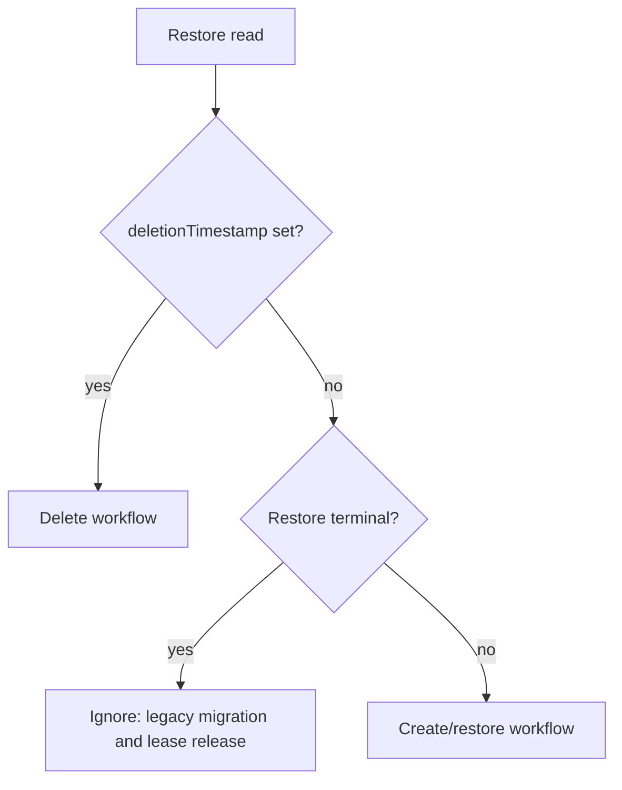
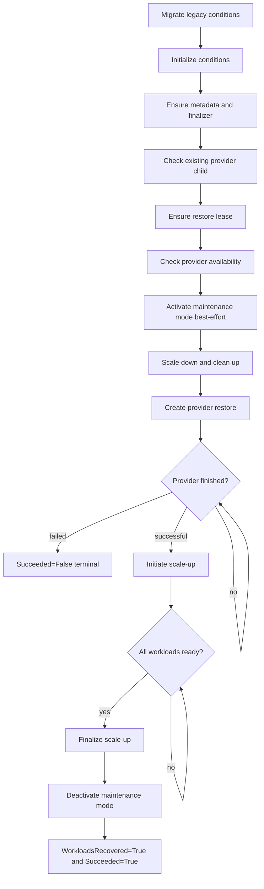
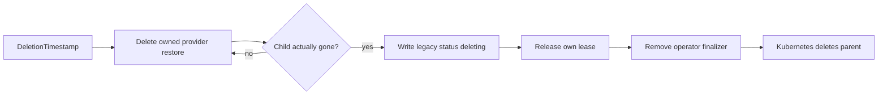

# Restore process

This documentation describes the `k8s-backup-operator` restore workflow.
A reconciliation does not execute the entire restore synchronously or block until it finishes.
Instead, the CR is processed up to the next stage that changes the resource, requires the operator to wait, or reports an error.

## Basic reconciler model

The reconciler distinguishes between three operations:



`Succeeded=True` and `Succeeded=False` are terminal. `Succeeded=Unknown` is explicitly non-terminal and means that the workflow must continue working or waiting. The deprecated scalar `status.status` field is still mirrored for older clients, but workflow control uses conditions.

The controller watches both parent `Restore` resources and owned Velero `Restore` children. There is deliberately neither a controller-wide event filter nor a `GenerationChangedPredicate`: provider phase changes as well as status, finalizer, and deletion events on the parent must be able to trigger a reconciliation.

Logging uses the `logr.Logger` provided by `controller-runtime` in the `context.Context`. Restore stages and the managers they call therefore pass the existing context along and access the logger through `internal/logging`; an additional logger parameter or reinitialization per method is unnecessary. Creating a new `context.Background()` within the workflow would lose the request logger as well as cancellation and deadline information and should therefore be avoided.

### Stage results

A stage returns exactly one of the following results:

| Result | Meaning |
|---|---|
| `next()` | The stage has already converged; the next stage may run during the same reconciliation. |
| `retryAfter(d)` | The reconciliation ends in a controlled manner and runs again after the duration `d` specified by the stage. If `d` is not positive, `runStages` uses the requeue interval configured through `requeueTimeSeconds`. Some stages explicitly return the internal fixed value of five seconds. |
| `retryOnError(err)` | The reconciliation ends with an error; `controller-runtime` applies exponential backoff. |
| `abort()` | The reconciliation ends without an explicit requeue, for example after a terminal result. |

A stage that writes data normally ends the current reconciliation. This prevents multiple external mutations from running against a potentially stale restore object. Watch events are the primary trigger; the time intervals also provide a fallback for lost events. Many stages use the interval configured through `requeueTimeSeconds` for normal controlled retries, while some explicitly use the fixed internal value of five seconds. While the provider is working, the fallback is fixed at five minutes. None of these intervals apply to `retryOnError(err)`; in that case, the exponential backoff from `controller-runtime` determines the next attempt.

## Overall flow of a successful restore

The create stages run in the following order:



In terms of method names, the sequence is:

1. `ensureLegacyConditionsMigrated`
2. `ensureConditionsInitialized`
3. `ensureMetadata`
4. `ensureProviderChildState`
5. `ensureActiveRestoreLease`
6. `ensureProviderReady`
7. `ensureMaintenanceModeActivated`
8. `ensurePreparation`
9. `ensureProviderRestore`
10. `ensureProviderCompletion`
11. `ensureScaleUpInitiated`
12. `ensureWorkloadsReady`
13. `ensureScaleUpFinalized`
14. `ensureMaintenanceModeDeactivated`
15. `ensureRestoreCompleted`

## Conditions and transitions

Every new, running restore initially receives these four conditions with `Status=Unknown` and `Reason=Pending`:

- `Succeeded`
- `Prepared`
- `ProviderSucceeded`
- `WorkloadsRecovered`

An existing condition is not reset to `Unknown` during initialization. This is important when a status write succeeds but the process crashes immediately afterward.

### `Succeeded`

`Succeeded` is the overarching completion condition and is relevant to lease handling.

A valid operation lease always contains holder UID, holder name, and holder kind together. If any of these fields is missing, the manager reports the lease as invalid; it is not reconstructed from other resources or repaired automatically.

| Status | Reason | Meaning |
|---|---|---|
| `Unknown` | `Pending` | The workflow was observed but has not yet reached the next milestone. |
| `Unknown` | `WaitingForActiveRestore` | Another non-terminal restore or backup holds the lease. Destructive stages are not started. |
| `Unknown` | `RestoreLeaseAcquired` | The waiting restore now owns the lease and may continue. |
| `Unknown` | `InvalidRestoreLease` | The lease is missing the holder UID, holder name, or holder kind. Manual inspection and possibly deletion are required. |
| `True` | `RestoreCompleted` | The entire workflow, including readiness, label cleanup, and maintenance-mode deactivation, has completed. |
| `False` | `ProviderRestoreFailed` | The provider restore failed terminally. |
| `False` | `ProviderRestoreConflict` | A provider resource with the same name cannot safely be associated with this restore. |
| `True/False/Unknown` | `MigratedFromLegacyStatus` | Derived from the old scalar status of a restore created with an earlier operator version. |

`Succeeded=True` is written only in `ensureRestoreCompleted`, together with `WorkloadsRecovered=True`.

### Legacy compatibility status

Every status write also synchronizes the deprecated `status.status` field. The mapping is:

| State | `status.status` |
|---|---|
| `metadata.deletionTimestamp` set | `deleting` |
| No `Succeeded` condition, workflow already observed | `inProgress` |
| `Succeeded=Unknown` | `inProgress` |
| `Succeeded=True` | `completed` |
| `Succeeded=False` | `failed` |

Conversely, for older restores without a `Succeeded` condition, an existing `completed`, `failed`, or `inProgress` value is persisted once as `Succeeded=True`, `False`, or `Unknown`, respectively, with `Reason=MigratedFromLegacyStatus`. An existing condition always takes precedence over the legacy field. An unknown, new, or deleting legacy status is not interpreted as a result.

### Metadata before the workflow

Before acquiring the lease and starting destructive preparation, `ensureMetadata` ensures the operator finalizer and the CES labels `app=ces` and `k8s.cloudogu.com/part-of=backup`. Both changes are written in a shared parent update that is capable of being a no-op. An actual write ends the current reconciliation so that subsequent mutations operate on the persisted resource.

### `Prepared`

| Status | Reason | Meaning |
|---|---|---|
| `Unknown` | `Pending` | Preparation has not completed yet. |
| `False` | `PreparationFailed` | Scale-down or cleanup failed; the operation is retried with backoff. |
| `True` | `PreparationCompleted` | Workloads were scaled down and restore resources were cleaned up. |

Before activating maintenance mode and starting destructive preparation, `ensureProviderReady` checks whether the provider is available. If the restore is already considered prepared based on its `Prepared` condition or an unambiguously associated provider child, this check is skipped. This prevents a resumed restore from being blocked by another provider readiness check.

The dedicated `ensureMaintenanceModeActivated` stage then activates maintenance mode on a best-effort basis. It first checks the actual state and activates maintenance mode only if it is still inactive. An error is logged and reported as an event but does not prevent the restore. The stage does not persist a condition and may proceed directly to preparation during the same reconciliation. Scale-down and cleanup, by contrast, must succeed. If an unambiguously associated provider child already exists, preparation is likewise considered complete. This prevents a second cleanup in the critical crash window between child creation and the parent status write.

### `ProviderSucceeded`

| Status | Reason | Meaning |
|---|---|---|
| `Unknown` | `Pending` | The provider stage has not been reached yet. |
| `Unknown` | `ProviderRestorePending` | The provider child exists but has not started yet. |
| `Unknown` | `ProviderRestoreRunning` | The provider is working. |
| `Unknown` | `ProviderRestoreStateUnknown` | The provider reports a phase unknown to the operator. It is never interpreted as success. |
| `True` | `ProviderRestoreCompleted` | The provider successfully restored the backup contents. |
| `False` | `ProviderRestoreFailed` | The provider reports a terminal error, including validation and partial failures. |
| `False` | `ProviderRestoreConflict` | A child with the same name cannot safely be adopted. |

For pending, running, or unknown states, the controller waits for child events; a fallback requeue occurs after five minutes. Only `True/ProviderRestoreCompleted` allows the workflow to proceed to workload recovery.

The following conditions are also set after a provider failure:

- `WorkloadsRecovered=False/RecoveryNotAttemptedAfterProviderFailure`
- `Succeeded=False/ProviderRestoreFailed`

The workloads deliberately remain scaled down on this error path. Maintenance mode is deactivated on a best-effort basis. Because `Succeeded=False` is terminal, another restore can subsequently take over the lease. Developers must account for this deliberately different safety model of the error path when making changes.

### `WorkloadsRecovered`

This condition represents several non-terminal recovery steps. Its status remains `Unknown` until the final step.

| Status | Reason | Writing stage | Meaning |
|---|---|---|---|
| `Unknown` | `Pending` | Initialization | Recovery has not started yet. |
| `Unknown` | `ScaleUpInitiated` | `ensureScaleUpInitiated` | Original desired replica counts were written back to `spec.replicas`. Pods do not have to exist or be ready yet. |
| `Unknown` | `WaitingForWorkloads` | `ensureWorkloadsReady` | At least one workload has not reached its target state. Requeue after five seconds. |
| `Unknown` | `WorkloadsReady` | `ensureWorkloadsReady` | All observed workloads meet every readiness criterion. |
| `Unknown` | `ScaleUpFinalized` | `ensureScaleUpFinalized` | Temporary replica labels were removed. |
| `Unknown` | `MaintenanceModeDeactivated` | `ensureMaintenanceModeDeactivated` | Maintenance mode was successfully deactivated. |
| `True` | `WorkloadRecoveryCompleted` | `ensureRestoreCompleted` | Recovery is fully complete. |
| `False` | `WorkloadRecoveryFailed` | Scale-up/finalization | A recovery step failed and is retried. |
| `False` | `RecoveryNotAttemptedAfterProviderFailure` | Provider failure path | Recovery was deliberately not started. |

## Error and restart behavior

The workflow is level-triggered: conditions document progress, but external resources remain the source of truth for actions that have already run.

Typical examples:

- **Status conflict:** The condition write fails; the stage is retried with backoff.
- **Crash after workload update:** `ScaleUp` or `FinalizeScaleUp` runs again idempotently.
- **Lost watch event:** Controlled fallback requeues trigger observation again.
- **Partial label cleanup:** The permanent scope label keeps all objects discoverable; only replica labels that are still present are removed.
- **Readiness regression:** `WorkloadsReady` is not a free pass; the next run checks again and may return to `WaitingForWorkloads`.
- **Unknown provider phase:** Remains `Unknown`, never implicit success.
- **Foreign provider child:** Terminal `ProviderRestoreConflict` before destructive preparation begins.

## Delete workflow

Deleting a restore follows its own stage order:



A deletion request for the provider child is not confused with its actual removal. The parent retains its operator finalizer until a later `Get` confirms that the child no longer exists. Foreign children with the same name are not deleted and do not block parent deletion. A targeted exception applies to restores with `Reason=MigratedFromLegacyStatus`: their provider children may predate owner references and are therefore deleted even without provable ownership. Other finalizers not owned by the operator remain untouched.

## Acceptance tests

The cluster acceptance tests are located in `acceptance-tests/restore_test.go`. They are excluded from normal unit test runs by the `acceptance` build tag and use Ginkgo/Gomega.

### Safety requirements

The restore specs are destructive and must only run against a disposable test cluster. In the `ecosystem` namespace, all Dogus and all ConfigMaps, Secrets, and PVCs covered by the restore scope are cleaned up. The suite is therefore `Serial` and `Ordered`.

`K8S_TEST_CLUSTER_KUBECONFIG` must point to **exactly one** kubeconfig file. A KUBECONFIG list is deliberately rejected to prevent precedence rules from accidentally selecting the wrong cluster. The API server actually used is printed before the run.

Before the test, the suite also checks whether a deployment still has a temporary `restore-scaledown-replicas` label left by an aborted restore. Such leftovers would restore a stale desired replica count and therefore produce misleading results.

### Covered scenarios

#### Successful creation

The spec creates a disposable deployment with two replicas and a scope label, as well as an additional ConfigMap with a backup scope label created after the backup. It then verifies:

1. The provider restore is created.
2. As soon as the provider restore becomes visible, maintenance mode is active with the restore title and text.
3. The parent reaches the legacy compatibility status `completed`.
4. Maintenance mode is inactive again after completion.
5. The ConfigMap not included in the backup remains deleted after cleanup.
6. The deployment is scaled back to exactly two replicas.
7. The temporary replica label was removed.
8. All PVCs are `Bound`, and all deployments have their desired number of `ReadyReplicas`.
9. A forced reconciliation of an already completed restore changes neither status nor replica count.

PVC and workload convergence is polled for up to 15 minutes. A terminal failed backup or restore status stops waiting early and appends the observed status to the Ginkgo failure.

#### Deletion

Test-owned hold finalizers make the otherwise brief intermediate states observable. The test verifies:

1. The provider child begins terminating while the operator finalizer protects the parent.
2. After the child hold is released, the provider restore actually disappears.
3. The parent persists `deleting`, removes only the operator finalizer, and preserves foreign finalizers.
4. After the parent hold is released, the parent is deleted as well.

#### Two competing restores

The spec creates two restore resources simultaneously and dynamically identifies the winner and the waiting restore. It verifies:

1. Only the lease holder may start a provider restore.
2. The waiting restore reports `Succeeded=Unknown/WaitingForActiveRestore` and does not have a provider child yet.
3. Only after the first restore is fully `completed` does `leaseTransitions` increase and the lease move to the waiting restore.
4. The second restore then also starts and completes its provider restore.

This means the acceptance test covers the critical invariant precisely: the lease is handed over only after recovery has fully completed, not immediately after setting `spec.replicas`.

## Test targets and filters

### All acceptance specs

```bash
K8S_TEST_CLUSTER_KUBECONFIG=/absolute/path/to/kubeconfig \
  make acceptance-test
```

The target invokes Ginkgo recursively and in parallel with the `acceptance` build tag:

```text
go run github.com/onsi/ginkgo/v2/ginkgo -p -r --tags=acceptance ./acceptance-tests/...
```

### Restore acceptance tests only

The preferred target is:

```bash
K8S_TEST_CLUSTER_KUBECONFIG=/absolute/path/to/kubeconfig \
  make acceptance-test-restore
```

It delegates to `acceptance-test` and sets `GINKGO_LABEL_FILTER=restore`. The following is equivalent:

```bash
K8S_TEST_CLUSTER_KUBECONFIG=/absolute/path/to/kubeconfig \
  make acceptance-test GINKGO_LABEL_FILTER=restore
```

Arbitrary Ginkgo label expressions are supported, for example:

```bash
make acceptance-test GINKGO_LABEL_FILTER='restore && !slow'
```

The restore suite currently has the `restore` label; additional labels would first have to be added to the specs.

### Filter by spec text

`GINKGO_FOCUS` can select a subtree or an individual spec using a regular expression:

```bash
K8S_TEST_CLUSTER_KUBECONFIG=/absolute/path/to/kubeconfig \
  make acceptance-test-restore GINKGO_FOCUS='Creating a Restore'
```

Further examples:

```bash
make acceptance-test-restore GINKGO_FOCUS='Deleting a restore'
make acceptance-test-restore GINKGO_FOCUS='Serializing concurrent Restores with a Lease'
make acceptance-test-restore GINKGO_FOCUS='scaled-down workload is back'
```

Label and focus filters can be combined. Shell quoting is important because spaces and regular expressions would otherwise be split by the shell or by `make`.
